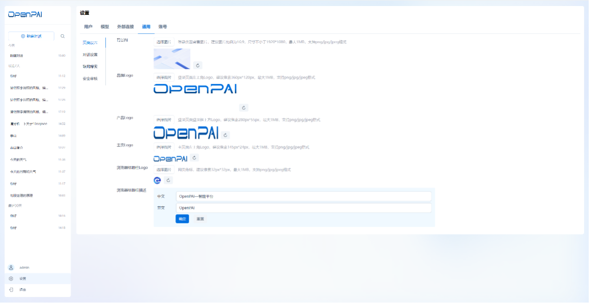
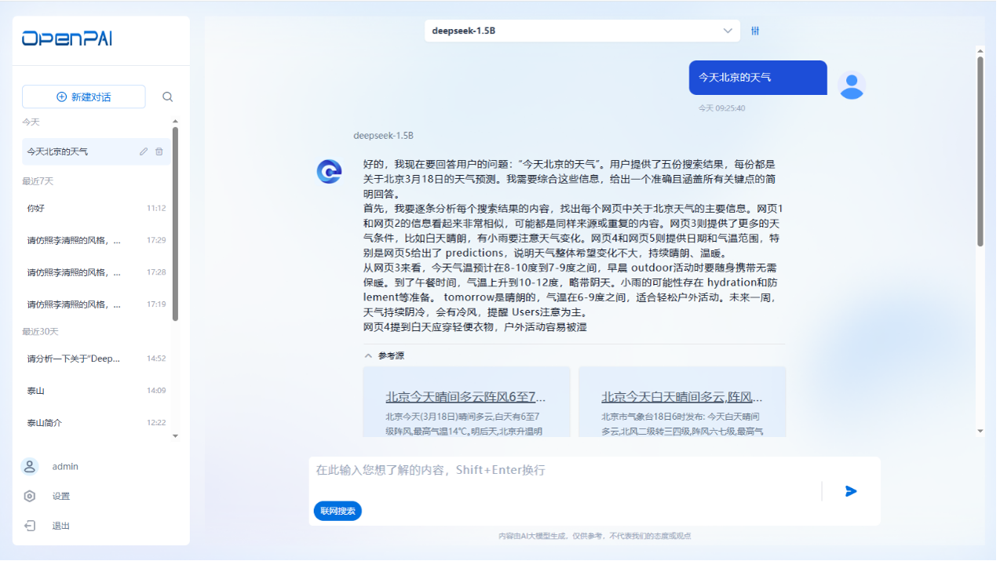

# OpenPAI

## 1. 平台概述
OpenPAI产品是一个轻量化的大模型应用开发平台，可快速部署，能够与接入本地、企业服务器、公有云模型服务，目标是让用户通过可视化Web界面轻松与LLM 进行交互，并基于接入的大模型服务快速搭建LLM应用。


平台支持接入OpenStation部署上线的模型服务，也支持接入第三方的模型来源。目前发布的是OpenPAI的第一个版本，需要与OpenStation配套部署和使用。

## 2.安装部署

OpenPAI V1.0需要依赖 OpenStation 的账户系统，所以在部署 OpenPAI 之前，请先安装 OpenStation，在 OpenStation 中创建的用户，可直接用于登录 OpenPAI 

### 2.1 下载镜像

```bash
docker pull easyds-registry.cn-beijing.cr.aliyuncs.com/faststack/openpai:v1.0
```

### 2.2 部署服务

镜像拉取完成后，查看是否有此镜像：

```shell
docker images
```

如出现`easyds-registry.cn-beijing.cr.aliyuncs.com/faststack/openpai:v1.0`的镜像，说明镜像加载成功。

执行如下命令启动容器：

```shell
docker run -d --rm --name CONTAINER-NAME --network=openstation -p HOST_PORT:8080 -e OPEN_DB_HOST=HOST-IP -e OPEN_DB_USER=DB-USER -e OPEN_DB_PASSWORD=DB-PASSWORD IMAGE-NAME:IMAGE-TAG
```

其中修改项如下：CONTAINER-NAME为容器名；HOST_PORT为平台访问地址；HOST-IP为主机IP地址；DB-USER为opnepai平台数据库root用户；DB-PASSWORD为opnepai平台数据库root用户登录密码；IMAGE-NAME:IMAGE-TAG为镜像名称和标签，一般为openpai:v1.0，以上请根据实际情况修改。

## 3.登录

平台安装部署成功后，在浏览器输入平台访问地址，可打开平台的登录页。输入正确的用户名和密码后，能够访问OpenPAI的主页，体验和使用OpenPAI的各项功能。


平台提供管理员和普通用户两种角色。针对不同角色，平台目前提供的功能如下：
- 对于管理员，平台支持管理员在设置页面查看全部用户、模型接入和通用参数设置，以及体验大模型对话能力
- 对于普通用户，平台支持用户体验大模型对话能力和修改用户密码

## 4.管理员功能
管理员账号登录成功后，可打开OpenPAI的主页-“对话”页面，支持管理员体验LLM对话功能，也支持管理员在设置进行各项功能的配置

### 4.1.设置
在页面左下角点击“设置”，进入管理员的设置页面。平台提供了“用户”、“外部连接”、“模型”、“通用”和“账号”的设置能力。
#### 4.1.1.用户
目前OpenPAI与OpenStation共用同一套用户信息，支持管理员在“用户”页面查看平台的全部用户。用户的增加、删除需要在OpenStation的用户管理进行操作。


#### 4.1.2.外部连接
平台初始安装部署成功后，在对话页面的可用模型为空，**需要管理员在设置页面接入外部的模型来源地址，以获取不同模型提供商的模型服务**。

在“设置”-“外部连接”页面，点击“添加”，可新增一个外部连接。在新增外部连接页面，需填写模型提供商名称、Base URL地址、API Key信息。添加外部连接成功后，会在列表中显示一条新的记录。在列表页，支持对连接进行编辑、删除和刷新操作

新增的连接默认是“禁用”的，手动开启连接后，平台将会根据填写的URL地址和API Key获取这个地址下的全部模型服务，并显示在“模型”列表下。

当某个连接地址失效，可选择删除这个连接。若删除某个连接，则从这个连接地址下获取的全部模型将会自动从“模型”列表上删除

当某个连接地址下的模型列表产生更新，支持管理员手动点击刷新按钮，平台将会从这个连接地址重新读取模型列表，并同步更新“模型”列表。

若不想启用某个连接地址的模型，可将这个连接的状态设置“禁用”，当某个连接地址被禁用，则不会从这个连接地址获取新的模型，且从这个地址获取的模型为不可用状态，用户无法在“对话”页面选择这些模型进行对话。


#### 4.1.3.模型
当管理员在“外部连接”添加一个连接后，可自动获取这个连接地址下的全部模型，并显示在模型列表下。模型列表支持查看模型名称、描述、权限、是否为默认模型、创建时间
在模型列表，支持对模型进行编辑、设为默认操作。


- **编辑**：选择某个模型，点击“编辑”，打开模型的编辑页面，支持修改模型的权限范围、模型参数。
    - 当模型权限范围设置“公开”，则全部用户可在对话页面查看到该模型，并能够进行对话；若权限范围设置为“私有”，则无法在对话页面查看该模型
    - 支持修改各项模型参数的默认值，设置成功后，对全局用户生效
- **设为默认**：选择某个模型，点击“设置为默认”，则代表用户的新建对话页面默认选中该模型进行对话；若无默认模型，则在用户的新建对话页面，默认显示最新的一个模型；最多只有1个默认模型


#### 4.1.4.通用
管理员在“设置”-“通用”页面，可对登录页、对话页面的基础信息进行页面，也支持对调用的插件进行全局参数设置。

**a. 页面设置**

支持在“页面设置”对平台的登录背景图、产品logo、标题栏等信息进行修改和重置，方便管理员根据自身企业的需求进行页面的定制化修改



**b. 对话设置**

支持在“对话设置”对用户的对话默认页面进行修改，包括产品slogan、欢迎语和引导问题、免责声明进行自定义设置


**c. 联网搜索**

支持管理员设置是否开启“联网搜索”的插件调用。当管理员禁用该插件后，全局用户无法在“对话”页面使用联网搜索的能力；当管理员启用联网搜索并配置检索方式、API Key的参数，配置后点击“保存”，则代表开启联网搜索成功，全局用户可在“对话”页面选择是否要调用该插件进行对话


**d. 安全审核**

支持管理员设置是否开启“安全审核”的能力。“安全审核”能力包括敏感词识别和内容安全审核两方面。当未勾选任何一种能力，则代表全局用户在“对话”页面进行对话时，无任何安全审核，可随意提问；当管理员勾选其中一种能力并配置相关参数后，则代表用户在进行对话过程中，平台可自动对用户的提问进行安全审核或敏感词失败。若用户提问涉及到敏感问题，则对话会输出对应的提示


#### 4.1.5.账号
支持管理员在“账号”页面，查看个人的基本信息和修改密码。


开启密码修改后，需输入原始密码、新密码和再次输入新密码后，即可修改密码成功


### 4.2.对话
管理员除了管理不同模型协议的接入、全局插件参数设置外，也支持体验大模型对话能力

#### 4.2.1. 新建对话
点击“新建对话”，打开一个新的对话窗口。支持在对话窗口查看欢迎语、slogan、引导问题等信息


#### 4.2.2.模型参数
在对话窗口的顶部，显示当前选中的模型，支持从模型列表中切换模型选择，也支持点击设置按钮，对当前选择的模型进行参数设置。这里的参数设置仅针对此次对话生效。


#### 4.2.3.联网搜索
在对话窗口的输入区域，可选择“联网搜索”，再发送对话问题，则平台会从网络检索相关内容作为参考源来回答这次提问



## 5.普通用户功能
普通用户登录成功后，可打开OpenPAI的主页-“对话”页面，支持体验LLM对话功能

### 5.1.对话
#### 5.1.1.新建对话
点击“新建对话”，打开一个新的对话窗口。支持在对话窗口查看欢迎语、slogan、引导问题等内容


#### 5.1.2.模型参数
对话窗口的顶部，显示当前选中的模型，支持从模型列表中切换模型选择，也支持点击设置按钮，对当前选择的模型进行参数设置。这里的参数设置仅针对此次对话生效。


#### 5.1.3.联网搜索
在对话窗口的输入区域，可选择“联网搜索”，再发送对话问题，则平台会从网络检索相关内容作为参考源来回答这次提问


### 5.2.设置
#### 5.2.1.账号
支持普通用户在“设置”-“账号”页面查看个人的基本信息和修改密码。
开启密码修改后，需输入原始密码、新密码和再次输入新密码后，即可修改密码成功

