<a href="../README_en.md">Back</a>  

# OpenPAI User Guide

---

This user manual is intended for administrators and standard users to help understand and proficiently operate various features provided by OpenPAI. This manual assumes you have successfully installed and launched OpenPAI.

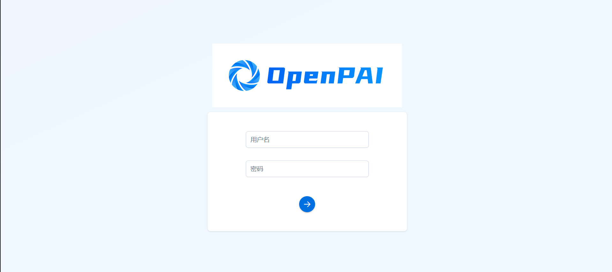

After the platform is successfully installed and deployed, enter the platform access address in the browser to open the platform login page. After entering the correct username and password, you can access the OpenPAI homepage and experience and use the various functions of OpenPAI.

## 1. Administrator Functions

Administrators have advanced management permissions, able to configure users, models, and global parameters in the "Settings" section, and manage applications, datas, and so on.

### 1.1 Platform Home Page
After successful login, the **OpenPAI** homepage is displayed. Administrators can click the left or top menu to access core modules like "Model Service", "MCP", "APP", "Data", "System", etc.

### 1.2 Model Service

On the homepage, you can click the **`Model Service`** submenu under **「Model Service」** to enter the model service management module.

Administrators can introduce their own service providers by clicking "Add Model Service Provider". The model addition feature includes multiple built-in templates. Users can select a template and fill in the API-KEY for quick addition, or manually enter the service provider name, API-KEY, and service URL.

If the URL is accessible and supports obtaining the model list via the OpenAI protocol, the corresponding model services will be automatically added to the platform during the addition process; if not, the corresponding model service list will be empty. If the URL does not support obtaining the model list, users can manually add model services under the corresponding model service provider using the add function, which requires filling in the correct model name and URL.

Administrators can modify the parameters of added model service providers through the settings function. After saving, the system will re-obtain the model service list via the URL. Users can also delete the corresponding model service providers through the settings > remove function. The service synchronization function is used to obtain the latest model service list from the service provider. If a model service saved on the platform is not in the service provider's new model service list, it will be removed from the platform's list; if there are new model services in the service provider's new list, they will be added to the platform. After a model is added to the platform, administrators can configure its sharing scope through the sharing function, setting it to be visible to all users or only to specific users. When set to be visible to specific users, only those within the sharing scope can use the corresponding model for conversations.

### 1.3 MCP
On the homepage, you can click the `MCP` submenu under **「MCP」** to enter the MCP management module. The MCP module is divided into two parts: `MCP Manager` and `MCP Resource`, corresponding to the lifecycle management of MCP severs and resource recommendations, site navigation, and other functions.

#### 1.3.1 MCP Manager
The MCP Manager module includes operations such as Create, Check, Edit, Start/Stop, and Delete. Administrators can use this module to maintain and manage all MCP servers provided to users.
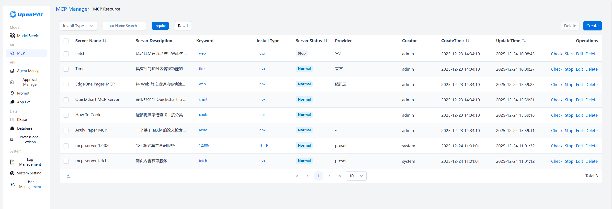

Click "Create" to add a MCP server, filling in the parameters of the MCP, or pasting JSON configuration for one-click entry.
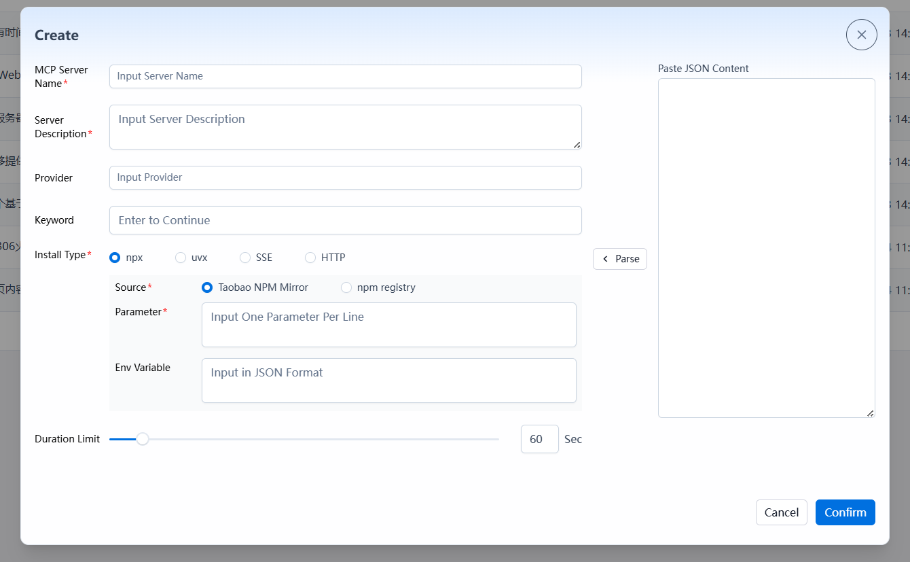
Click "Confirm", and the system will automatically validate the parameters and attempt to initialize the MCP server. After successful initialization, the server status will display as "Normal" and the tool list will be automatically retrieved; if it fails, you can modify the parameters and resubmit.

Click the "Check" button to view the basic configuration information of the MCP server, including server name, server description, keywords, and tool list.
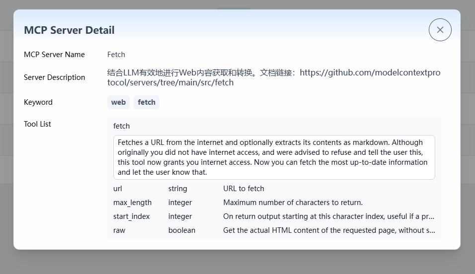

Click the "Stop" or "Start" button to switch the running status of the MCP server (Normal/Stop). After an MCP is stopped, users cannot select it in the chat interface.

#### 1.3.2 MCP Resource
MCP Resource provides administrators with MCP resource acquisition and site navigation functions, mainly including `MCP Recommend` and `MCP Site`.
The MCP Recommend page centrally displays MCPs curated and recommended by the platform. These recommended resources feature high availability, rich tool capabilities, and strong community support, making them suitable for new users to quickly get started.
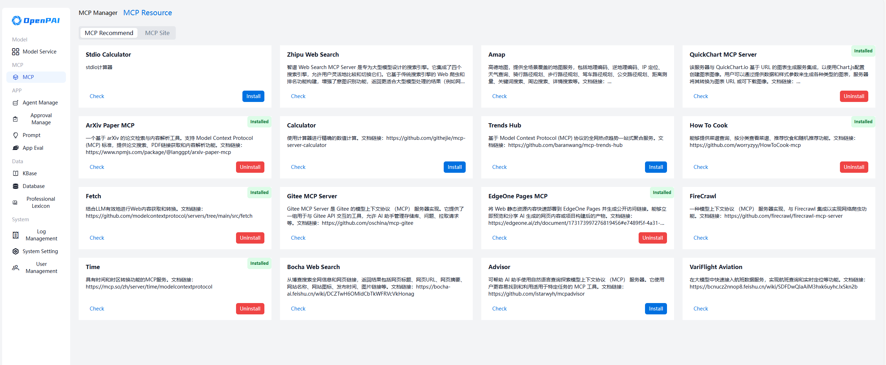

For MCPs that support "one-click installation", an "Install" button will be displayed on the card; users can click the "Install" button for one-click installation. If the installation is successful, it will prompt "Installation Successful", otherwise it will prompt "Installation Failed"; users can "Uninstall" already installed MCPs. Successfully installed MCPs can be viewed in the MCP management list.

For recommended MCPs that do not support "one-click installation", users need to obtain API KEY, ACCESS TOKEN, or other information from the respective MCP documentation as instructed, and manually add them through the "Create" interface on the MCP management page.

The MCP Site page aggregates commonly used MCP resource platforms, server repositories, official documentation sites, etc., facilitating administrators to quickly access, search for, and configure required MCPs and related resources.
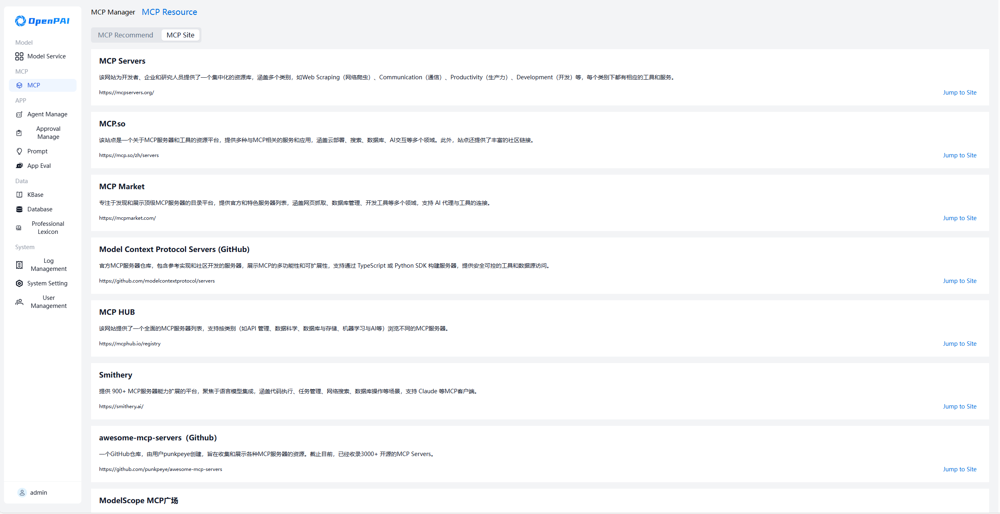

Note: Recommended MCPs and site resources are for reference only. It is recommended that administrators verify their availability and security before actual use.

### 1.4 APP

#### 1.4.1 Agent Manage

#### 1.4.2 Approval Manage

#### 1.4.3 Prompt

On the home page, click the `Prompt` submenu under **App** to enter the prompt engineering management module:

- Display all prompts on the platform
- Support paginated display
- Support search and query by prompt name or content
- Support ascending and descending sorting by title, create time, and update time
- Support sharing, transferring, and deleting prompts, all of which support batch operations

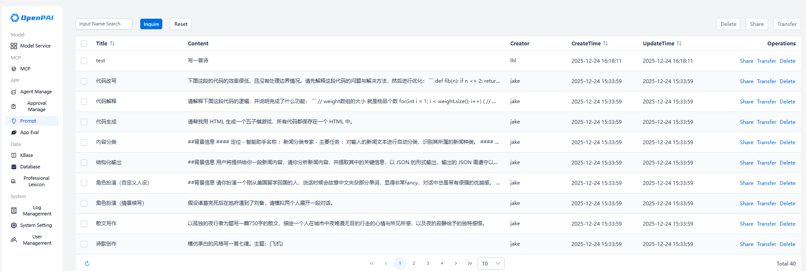

##### 1.4.3.1 Prompt Sharing
You can share prompts with other users or user groups through the prompt sharing feature.

- After entering the prompt sharing page, you can set the sharing scope. The default scope of each prompt is **“Self Only”**. The sharing scope can be **“Specific Users”** or **“All Users”**. When **“All Users”** is selected, the prompt is shared with all users.
- When **“Specific Users”** is selected, the prompt is shared with specific users or user groups. The initial sharing list is empty, meaning it is not shared with anyone. Click **“Add”** to open the add-user page, where all user groups and all users under the current user’s groups are displayed; you can share with user groups or individual users. After confirmation, you return to the sharing page and can see the selected users or user groups and remove any of them if needed. Click **“Confirm”** on the sharing page to take effect.
- Batch sharing is supported: on the list page, select multiple prompts and click the **“Share”** button to enter the sharing page. When performing batch sharing, all existing sharing records of the selected prompts will be cleared and replaced by the latest sharing configuration. Please pay attention to this behavior when using batch sharing.

##### 1.4.3.2 Prompt Ownership Transfer

You can transfer prompts created by a user to another user through the prompt ownership transfer feature. Batch transfer is also supported.

- After entering the prompt ownership transfer page, you can select a target user from the user list, or search by name and select a user from the search results for transfer.
- Once the transfer takes effect, the target user can view the corresponding prompts. The transfer will not affect the original sharing scope of the prompts; that is, if a prompt has already been shared with other users, transferring its ownership will not affect other users’ permissions to view or use the prompt.

##### 1.4.3.3 Prompt Delete
Administrator users can delete any prompts, supporting both single and batch deletion.

#### 1.4.4 App Eval

On the homepage, click the **"Applications"** submenu under the "Application Evaluation" sub-menu to access the Application Evaluation Management module. The information displayed in the task list includes: task name, creator, type, evaluation object, evaluation set (only for dialogue tasks and manual evaluation tasks, no evaluation set is shown as "--"; for batch evaluation tasks, the evaluation set name is displayed), number of evaluation questions (shown as the number of questions asked), status, and actions.
- Only dialogue task: No task status, displayed as "--"; Task operation: Deletion is allowed.
- Manual Evaluation Tasks: New tasks can be deleted; tasks in progress can be deleted; manually scored tasks can be deleted; completed tasks can be deleted.
- Batch Evaluation Tasks: In queue, can be pinned, moved to bottom, or deleted; in progress, can be paused/resumed or deleted; manual scoring, can be deleted; assisted scoring, can be paused/resumed or deleted; paused, can be deleted; already paused, can be resumed or deleted; completed, can be deleted.
The status of the batch evaluation task is: "In Progress" and "Auxiliary Scoring." The number of tasks is controlled by the maximum number of running batch evaluation tasks set in the administrator system settings page (note: "running" refers to tasks in "In Progress" and "Auxiliary Scoring" states).
The task status has been automatically switched to manual scoring upon completion of batch generation. It needs to be removed from task concurrency and can consume queued tasks to increase task concurrency.
The status of the platform's batch evaluation tasks is: "Generating and assisting scoring," with the number of tasks reaching the maximum limit for running batch evaluation tasks. When a regular user creates a batch evaluation task, it enters the queue. If the number of queued tasks for a single user reaches the limit set by the administrator in the system settings page, new batch evaluation tasks are prohibited, and a message is displayed: "Batch evaluation tasks have reached the maximum queued task limit.".

### 1.5 Data

#### 1.5.1 KBase

The knowledge base management feature is available to system administrators. In this module, administrators can view all knowledge bases across the entire platform and perform operations such as querying, sharing, transferring, scaling capacity up or down, and deleting knowledge bases.

#### 1.5.1 Knowledge Base List

The Knowledge Base List page displays all knowledge bases on the platform. It supports search and filtering by knowledge base type, language, and name. Sorting in ascending or descending order is supported by name, creation time, quantity, and size. Knowledge bases can be shared, transferred, scaled up or down, and deleted, and all of these operations support batch actions.

#### 1.5.2 Knowledge Base Sharing

Through the knowledge base sharing operation, a knowledge base can be shared with other users or user groups.

After entering the knowledge base sharing page, you can select the sharing scope and permissions. The default scope of each knowledge base is [All Users]. The sharing scope can be set to specific users or all users. Permissions can be set to Query or View. Query means that the user can only use the knowledge base but cannot view the document contents within it; View means that the user can not only use the knowledge base but also view the documents inside it.

When the sharing scope is set to [All Users], it means the knowledge base is shared with all users. The default permission is [View], and users can modify the permission as needed.

When the sharing scope is set to specific users, it means the knowledge base is shared with designated users or user groups. The initial sharing list is empty, indicating that it has not been shared with any users. Click the [Add] button to open the Add User page, which displays all user groups and all users under the user groups to which the current user belongs. The knowledge base can be shared with a user group or an individual user. The default permission is View, with Query and View as selectable options. After confirmation, you will return to the sharing page, where the selected users or user groups and their permission information are displayed. Selected users or user groups can be removed. Click Confirm on the sharing page to apply the sharing operation.

Sharing supports batch operations. On the list page, you can select multiple knowledge bases and click the Share button to enter the sharing page. When performing batch sharing, the original sharing records of the selected knowledge bases will be cleared and replaced by the latest sharing settings. Therefore, please pay attention to this behavior when performing batch sharing.

After the sharing operation takes effect, the shared users or members of shared user groups can view the corresponding knowledge bases under Knowledge Base - Shared by Others. They can also view the corresponding knowledge bases through the Knowledge Base List, and see their permission scope for each knowledge base based on the sharing permissions.

#### 1.5.3 Knowledge Base Permission Transfer

Through the knowledge base permission transfer operation, knowledge bases created by a user can be transferred to other users. Batch transfer is also supported.

After entering the knowledge base permission transfer page, you can select a user from the user list to transfer ownership, or search by name and select a user from the search results for transfer.

After the transfer operation takes effect, the target user can view the corresponding knowledge base under the Knowledge Directory. The transfer function does not affect the original sharing scope of the knowledge base. That is, if a knowledge base has been shared with other users before being transferred, the access permissions of those users will remain unchanged.

#### 1.5.4 Knowledge Base Capacity Scaling

Knowledge base capacity scaling allows capacity control for a single knowledge base. By default, a single knowledge base allows uploading up to 500 files. Administrator users can apply different capacity limits to different knowledge bases, with a capacity range of 200 to 1000. Administrator users can also perform batch capacity scaling for multiple knowledge bases.

#### 1.5.5 Delete Knowledge Base

Administrator users can delete all knowledge bases except built-in knowledge bases. Please note that deleting a knowledge base will delete both the knowledge base itself and all documents within it. Therefore, please delete knowledge bases with caution.

#### 1.5.2 DataBase

Administrators can access the database connection management page through the database module. The database connection management interface displays a list of database connections created by users, showing details including connection name, database type, database name, server address, port, number of tables, creator, sharing scope, and connection time. Users can filter database connections by connection type, connection name, and creator.

When the number of tables in a user's database changes, administrators can use the refresh function to update the table count for the corresponding database connection. Administrators can share database connections with other users, specifying either all users or specific users/groups. Shared connections will be visible and available for database conversations in the connection list of the target users or groups.

The transfer function allows administrators to transfer a specified database connection to another user. The target user list during transfer displays all users in the system. After the transfer, the creator of the database connection will be updated to the new user.

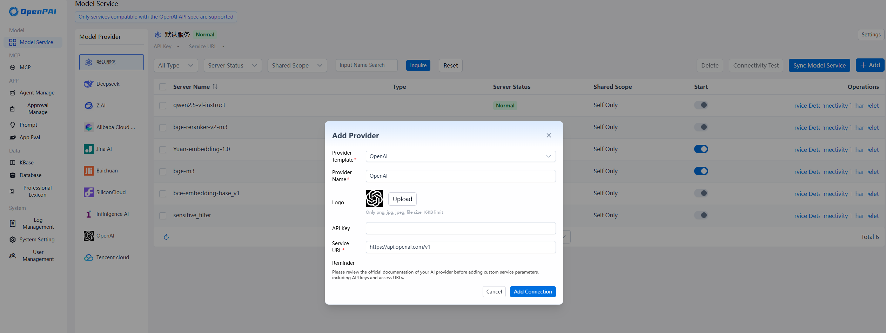

#### 1.5.3 Professional Lexicon

On the home page, click the `Professional Lexicon` submenu under **Data** to enter the professional lexicon management module.

- Display the list of all professional lexicons on the platform  
- Support paginated display  
- Support search and filtering by category, sharing scope, name, and creator  
- Support **Reset** to clear all filter conditions  
- Support ascending and descending sorting by name, creation time, and update time  
- Support sharing, transferring, and deleting lexicons, all of which support batch operations  

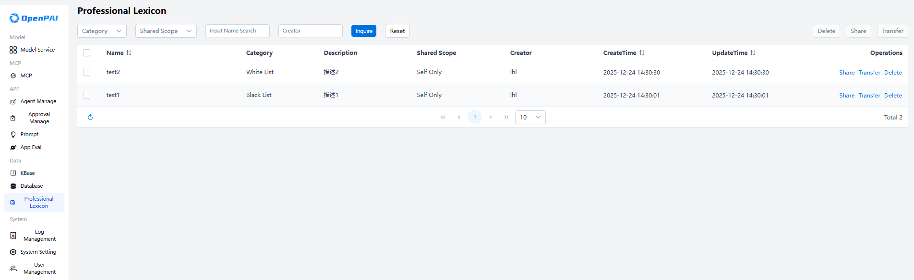

#### 1.5.3.1 Lexicon Sharing

You can share lexicons with other users or user groups through the lexicon sharing feature.

- After entering the lexicon sharing page, you can select the sharing scope. The default scope of each lexicon is **“Only Me”**. The sharing scope can be **“Some Users”** or **“All Users”**. When **“All Users”** is selected, the lexicon is shared with all users, with view and use permissions.
- When **“Some Users”** is selected, the lexicon is shared with specific users or user groups. The initial sharing list is empty, meaning it is not shared with anyone. Click **“Add”** to open the add-user page, where all user groups and all users under the current user’s groups are displayed; you can share with user groups or individual users. After confirmation, you return to the sharing page and can see the selected users or user groups and remove any of them if needed. Click **“Confirm”** on the sharing page to take effect.
- Batch sharing is supported: on the list page, select multiple lexicons and click the **“Share”** button to enter the sharing page. When performing batch sharing, all existing sharing records of the selected lexicons will be cleared and replaced by the latest sharing configuration. Please pay attention to this behavior when using batch sharing.
- After the sharing operation takes effect, all shared users or members of shared user groups can see the corresponding lexicons in the Professional Lexicon module.

#### 1.5.3.2 Lexicon Ownership Transfer

You can transfer professional lexicons created by a user to another user through the lexicon ownership transfer feature. Batch transfer is also supported.

- After entering the lexicon ownership transfer page, you can select a target user from the user list, or search by name and select a user from the search results for transfer.
- Once the transfer takes effect, the target user can view the corresponding professional lexicons. The transfer will not affect the original sharing scope of the lexicons; that is, if a lexicon has already been shared with other users, transferring its ownership will not affect other users’ permissions to view or use the lexicon.

#### 1.5.3.4 Lexicon Deletion

Administrator users can delete any professional lexicons, supporting both single and batch deletion.

**Note**: Deleting a lexicon will also delete all words within the lexicon. Please proceed with caution when deleting professional lexicons.

### 1.6 System

System Menu includes `Log Management`, `System Setting`, `User Management`.

#### 1.6.1 Log Management

After logging in, the administrator clicks **“Log Management”** on the left side of the page to enter this module.
The log list displays the following information: Operator, Module, Target, Operation type, Result, Feedback, Operation time, and Operations. The Operations include the data before and after the operation.

The administrator can perform combined queries based on criteria such as module, operation type, result, start time, end time, and operator. They can also click **“Reset”** to display the default results. In addition, the administrator can sort the following fields individually: module, operation type, result, and operation time.

The administrator can export the query results based on the selected conditions, with a maximum of 1,000 records per export. The exported file is in **.csv** format.

#### 1.6.2 System Setting
System settings include two tabs: business configuration and page configuration. Business configuration mainly involves basic business settings for various business modules in the system, aiming to better allocate system resources and utilize system capabilities effectively.

##### Business Config

##### Page Config
Page configuration primarily involves flexible configuration of the system to meet the personalized needs of various systems. It mainly involves configuring the browser title name, product logo, homepage logo, etc., which can be modified or reset.
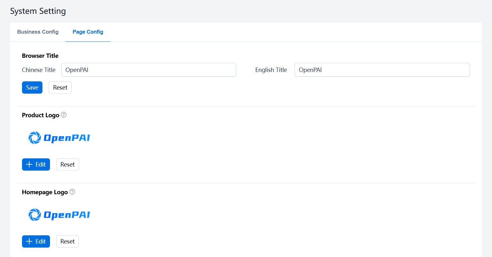

#### 1.6.3 User Management
On the homepage, you can click the **"Application"** menu and select the `User Management` submenu to access the user management module. The information displayed in the user list includes: username, role, description, creation time, and actions (password reset and deletion).
The administrator can create new users. The default password for the administrator is admin@123, and the default password for regular users is 123456a?
---

## 2. Standard User Functions

### 2.1 Overview

After successfully logging in as a Standard user, you can view an overview of the intelligent agents, engage in dialog interactions, and manage intelligent agents and prompt within the system. Additionally, you can evaluate various applications and manage various data, primarily including knowledge bases, databases, and professional lexicon. Regarding system usage, users can configure system settings to meet their personal preferences.

### 2.2 Chats

 **「Chats」** module user can experience interaction between large models, intelligent agents, and databases. Users can choose to have conversations with large models, intelligent agents, databases, and manage conversation information.

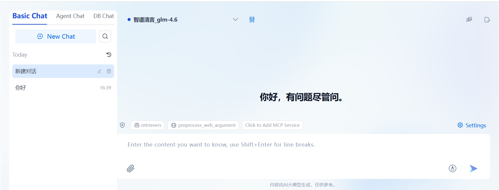

#### 2.2.1 New Chat

Click **「New Chat」**, the system will open a new chat window. Users can:
- Quickly enter chat mode

Open the page for creating a new chat, where users can see the object you want to interact with, such as a model, intelligent agent, or a database. If there is no intelligent agent, you can create one under the Agent module; If no database has been selected or created, database information can be created in advance under the Database module.

- Browse basic information of interactive objects

For different interaction objects, different information is displayed. If conversing with a large model, the model information is displayed and the model parameters can be modified; If conversing with an intelligent agent, display the agent's information; Similar database chat, displaying database connection information for users to choose from.

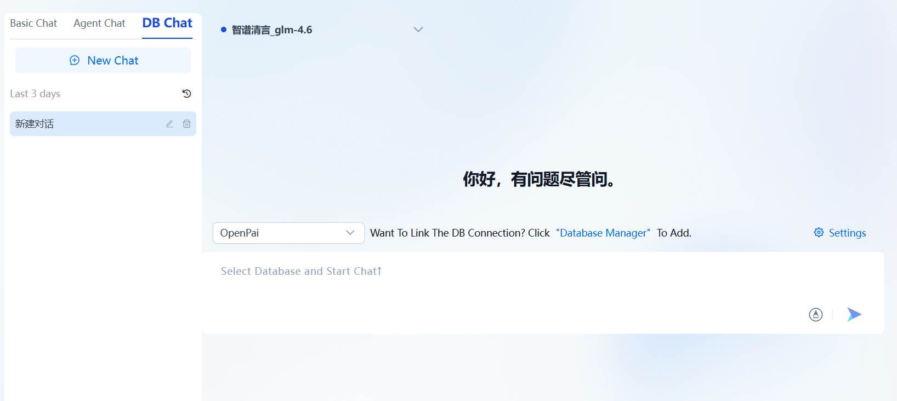

- Diversified chat and interaction to obtain results

Users can send questions and wait for the system to reply, and the reply content will be streamed out. The system supports uploading files, audio, and images in multiple formats and reply answers for them.

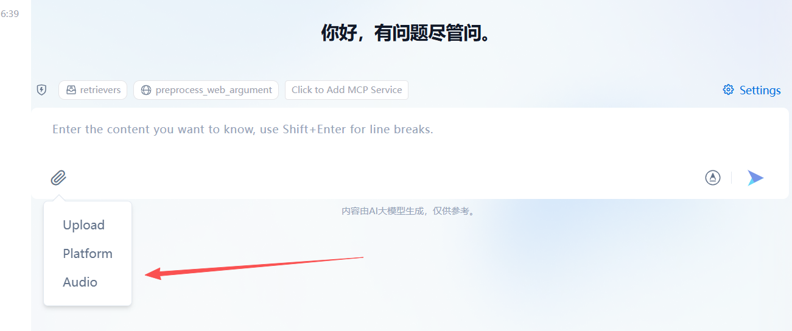

- Set interaction details to achieve precise and customized interactions

Users can change model parameters and select tools (such as sensitive filter, web search, knowledge base, MCP , etc.) for more detailed and accurate responses.

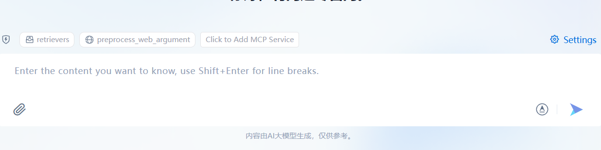

#### 2.2.2 chat management

- The system supports operations such as adding, deleting, modifying, and querying chat, changing names, and deleting chat
- Copy chat, for a certain chat, you can copy a new chat that contains all the configuration information of the current chat, without including the interaction history
- Export chat records. For chat interaction history, it can be exported as a markdown format file to the local device

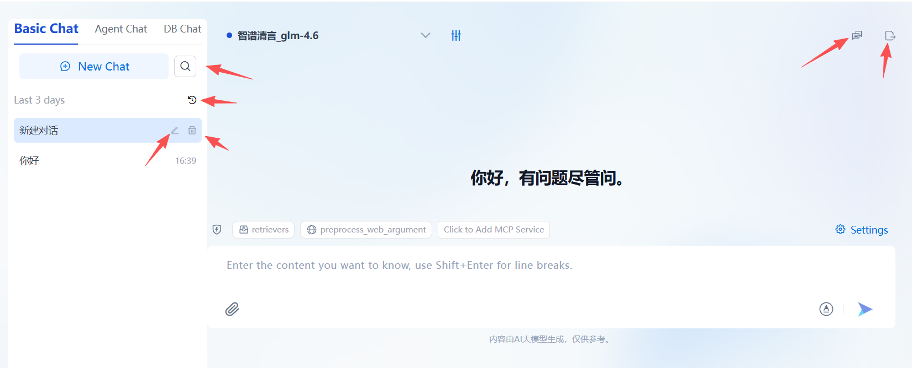

#### 2.2.3 chat content management

- Copy content: Users can quickly copy questions or answers
- Reference content: You can reference the previous content and continue to chat
- Regenerate the chat, users can regenerate the question of any chat
- Delete question-answer pairs: Users can delete multiple question-answer pairs and no longer display them
- Collection: Collect question-answer to Knowledge Base Module
- User evaluation answer quality: Support users to evaluate the answer results, like or dislike them

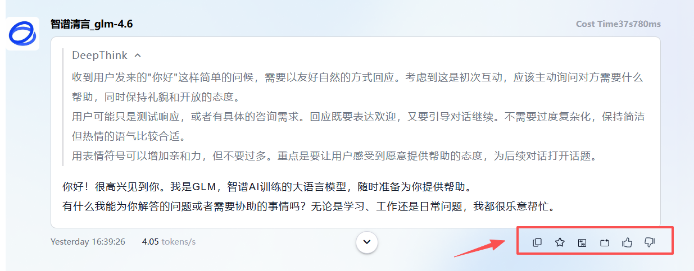

#### 2.2.4 Chat Tools

##### 2.2.4.1 Sensitive Filter Tool

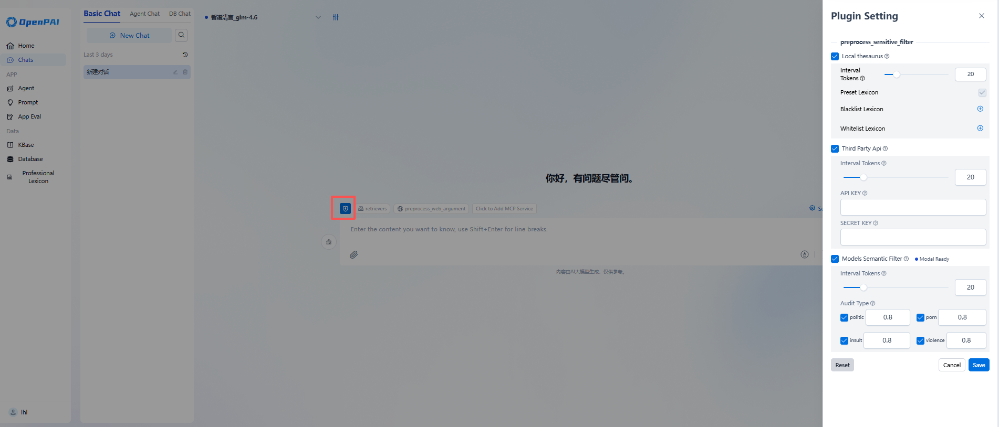

Activate the **preprocess_sensitive_filter** tool and click the **Settings** button. The tool parameter configuration page will be displayed in the right sidebar.

- The **preprocess_sensitive_filter** tool supports three content review methods: **Local thesaurus**, **Third Party Api**, and **Models Semantic Filter**. By default, **Local thesaurus** is used when the tool is enabled.
- The three review methods are presented as checkboxes and can be freely combined. After modifying parameters, click **Save** to apply the changes.
- Click **Reset** to restore parameters to their initial default values, then click **Save** to apply.

**Local thesaurus** supports the following parameters:
- **Interval Tokens**: default is 10, meaning the model performs a detection every 10 characters output. The larger this value, the coarser the detection granularity and the less time consumed. To ensure all content is reviewed, a detection will always be performed after the model finishes output.
- **Preset Lexicon**: system-preset blacklist lexicon, enabled by default and cannot be modified by users.
- **Blacklist Lexicon**: selecting a lexicon enables it. Content in the **Blacklist Lexicon** is prohibited from being output.
- **Whitelist Lexicon**: selecting a lexicon enables it. Content in the **Whitelist Lexicon** is allowed to be output.
- After modifying **Blacklist Lexicon** or **Whitelist Lexicon**, click **Save** to apply. **Whitelist Lexicon** has higher priority than **Blacklist Lexicon**. If a word is in the whitelist, it will not be blocked even if it is also in the blacklist.
- To add **Blacklist Lexicon** or **Whitelist Lexicon**: click the ⊕ button on the right to open a dialog showing all available blacklist/whitelist lexicons, with pagination support and name search. Click **Use** to select a lexicon (the button changes to "Unuse"). Click **Cancel** to stop using the lexicon. A maximum of 5 blacklist lexicons and 5 whitelist lexicons can be selected. If the limit is exceeded, further selection is not allowed and the "Use" button is grayed out.

**Third Party Api** currently only supports Baidu Intelligent Cloud's content review product, requires internet connection, and allows configuration of API KEY and SECRET KEY.

**Models Semantic Filter** relies on a semantic model fine-tuned on large amounts of data to accurately identify various sensitive texts and their variant non-compliant content. The semantic model must be in a ready state before use.
- Review types include **politic**, **porn**, **insult**, and **violence**, which can be freely enabled or disabled. The default threshold for all types is 0.8. Checking the **politic** checkbox means the political detection model will score the content to be reviewed. If the score exceeds the set threshold, it indicates non-compliant content; otherwise, it does not. Other detection models work similarly. If the **politic** checkbox is not checked, the content will not be scored for political content, and the **politic** threshold will not take effect.

If sensitive information is detected in the input, the system returns "Sorry, your input contains sensitive information. Please re-enter" to prompt the user to change the topic. If no sensitive information is detected, the system proceeds normally to the inference step.

If sensitive information is detected in the model output, the system returns "Sorry, the model output contains sensitive information. Please try again or change the topic." If no sensitive information is detected, the inference result is displayed normally.

##### 2.2.4.2 Web Search Tool

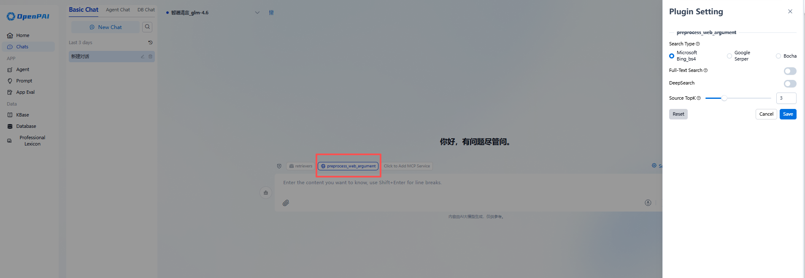

Activate the **preprocess_web_argument** tool and click the **Settings** button. The tool parameter configuration page will be displayed in the right sidebar.

Search methods include Bing Search, Google Search, and Bocha Search. Click the radio button to switch between them.
- **Full-text Search**: disabled by default. When enabled, it parses the full content of web pages; when disabled, it only uses the content summary of web pages.
- **DeepSearch**: disabled by default. When enabled, it displays results according to the following rules: ① Analyze the user's question; if it is a complex question, generate task steps; if it is a simple question, output the result directly; ② Each step status: Not Started → In Progress → Completed; ③ Each step has corresponding result output that can be viewed by clicking. When disabled, it directly outputs the answer.
- **Source TopK**: the number of reference URLs finally input to the large model. The larger this value, the longer the reference text and the slower the inference speed. The default value is 3, and the maximum is 8.
- **Google Serper**: requires a Key for calling the Serper API. Register and apply at the Serper website (https://serper.dev/).
- **Bocha**: requires a Key for calling the Bocha API. Register and apply at the Bocha website (https://open.bochaai.com/).

After modifying parameters, click **Save** to apply. Click **Reset** to restore parameters to their initial default values, then click **Save** to apply.

##### 2.2.4.3 Prompt Tool

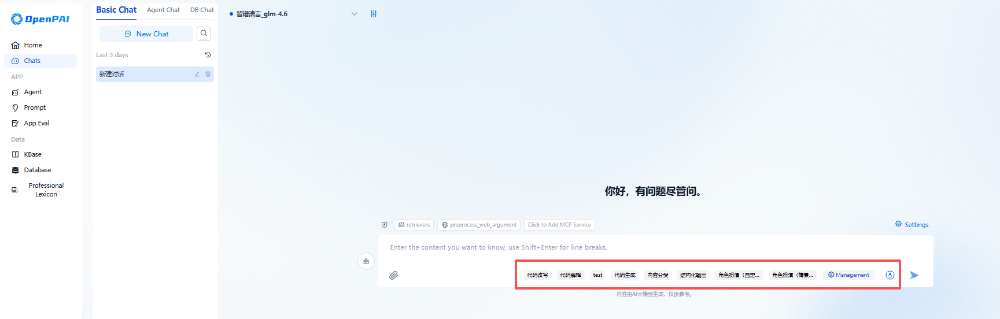

Click the prompt tool icon in the bottom right corner of the dialog box to display commonly used prompts; click again to close.

- Click the **Prompt A** button to insert Prompt A into the input area. The content in the input area can be edited by the user.
- Click **Management** to enter the **Prompt Manage** page to view details. Click × to close the **Prompt Manage** page.
- Usage is consistent with **2.4 Prompt Management**

##### 2.2.4.4 MCP
Click the "Clieck to Add MCP Service" button to display all currently available MCP servers and add them to the chat. Click the "Check" button to view the tools, resources, and prompt list of the MCP server.
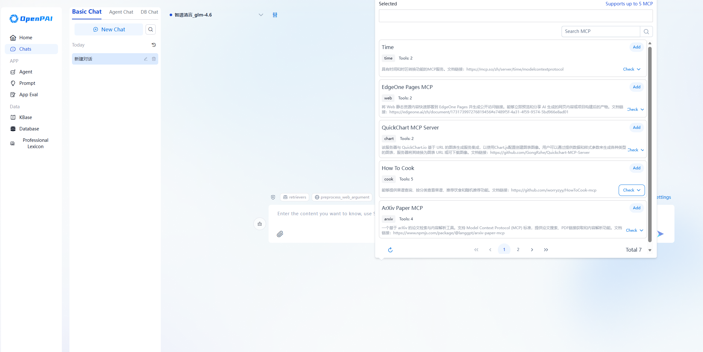

After completing the selection, engage in conversation. The model will selectively invoke tools based on the tool information and return the answers.
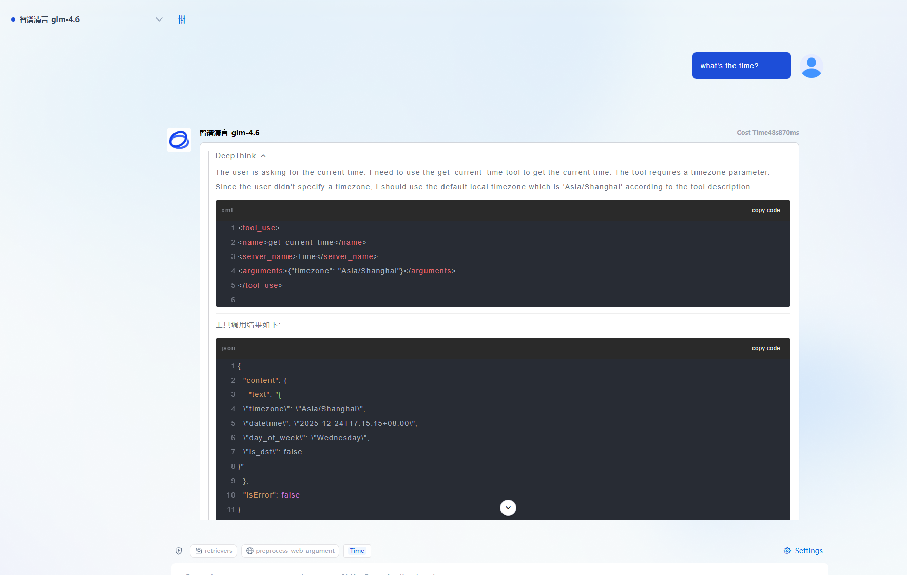
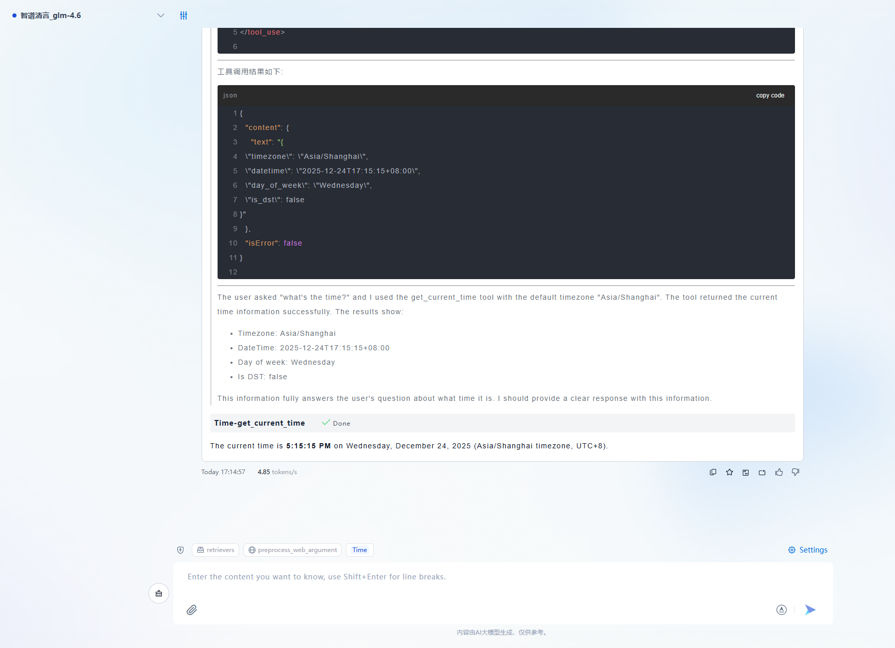

##### 2.2.4.5 Knowledge Base retriever Tool

###### 2.2.4.5.1 Retrieval Parameter Configuration

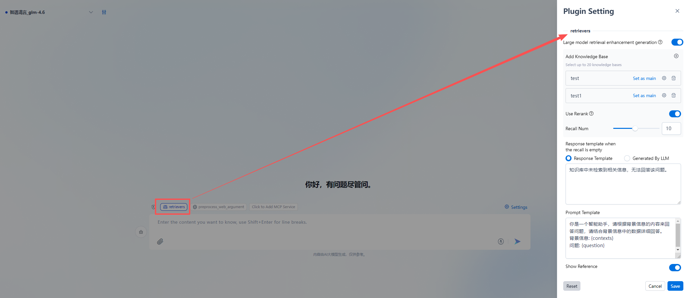

On the regular conversation page, activate the [retrievers] tool and click the [Settings] button. A knowledge base configuration page will appear in the right menu bar. The parameters from top to bottom are:

- Large Language Model Retrieval-Augmented Generation: Enabled by default. When enabled, after retrieving based on the user's question, the answer is processed by a large language model before output. When disabled, the most similar answer is directly retrieved and returned based on the user's question. When enabled, you can select from both document knowledge bases and question-answer knowledge bases. When disabled, only question-answer knowledge bases can be selected.

- Add Knowledge Base: By default, 1-20 knowledge bases can be selected, and one knowledge base can be set as the primary library. A maximum of one knowledge base can be set as the primary library. Setting a primary library means that relevant content is primarily retrieved from this library.

- Result Reranking: Indicates whether retrieval results need to be reordered by a Rerank model. Enabled by default.

- Recall Count: Represents the number of text chunks finally recalled. Default is 10.

- Reply Logic When Recall is Empty: Divided into two options: fixed reply and large language model generation. When fixed reply is selected, users can set custom reply text. When large language model generation is selected, the model answers the user question based on its own capabilities.

- Personalized Prompt: Also known as Prompt template. After background information is retrieved, the Prompt template is used to construct the prompt. If you are uncertain, use the default template. Currently, different templates can be automatically adapted based on the selected model.

- Show Reference Source: Whether to display superscripts and reference sources in the final model-generated response. Enabled by default.

    > When adding knowledge bases, the knowledge base list is divided into three tabs: All, Personal Creation, and Shared by Others, with filtering by type, language, and name supported. A maximum of 20 knowledge bases can be selected.

###### 2.2.4.5.2 Knowledge Base Parameter Configuration
In the selected knowledge bases, click the [Configuration] button on the knowledge base card to configure retrieval-related parameters. The page displays default parameters set when the knowledge base was created, and these parameters can be modified.

The retrieval process consists of two stages: coarse ranking and fine ranking. The coarse ranking stage primarily removes text that does not meet criteria and returns the first stage retrieval results. In the fine ranking stage, further similarity calculations are performed based on coarse ranking results to obtain qualified text results. For specific parameter descriptions, see the [Retrieval Testing](#retrieval-test) section.

###### 2.2.4.5.3 Knowledge Source Citation
After selecting the knowledge base, enter a question in the input box to perform question-answering based on the knowledge base. The response will provide corresponding reference sources and cited content based on actual citations. Click on a reference source to jump to the corresponding file, ensuring the model's answer is grounded in evidence.

Image source attribution is now supported. If the user's question is related to an image in the document, the corresponding image will be displayed. Users can click the reference superscript ([1] [2] [3]) below the image to jump to the original location.

Additionally, the reference sources section displays citation information for the corresponding documents in the knowledge base. As shown in the figure, clicking the reference superscript next to a file name jumps to the original location. Users can also download the corresponding document.

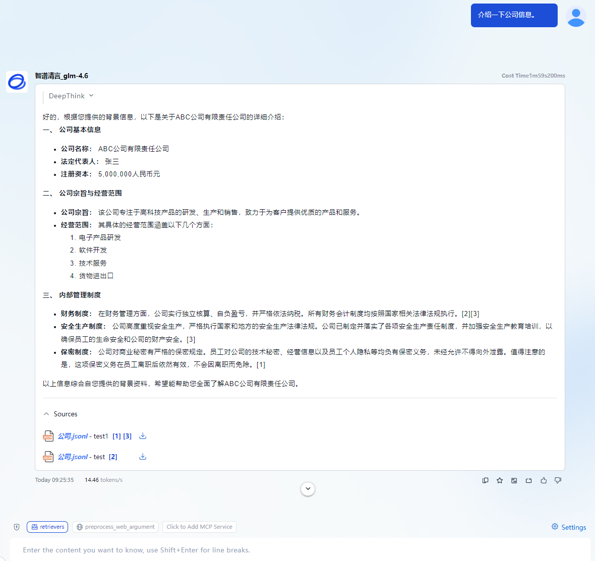

### 2.3 Agent Management

#### 2.3.1 Agent
- Agent query, display information includes: icon, name, only yourself/some users/all members, status, label, description information, creator name, creation time;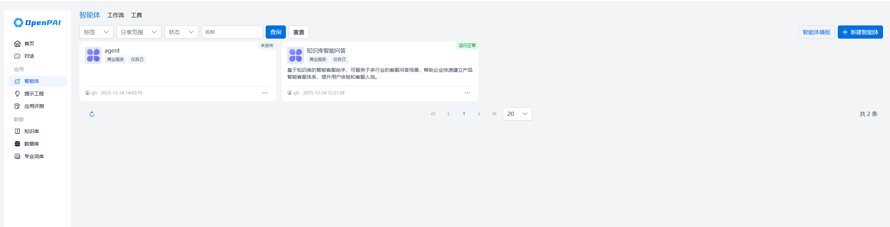
- Agent creation, you can create blank agents and create based on templates;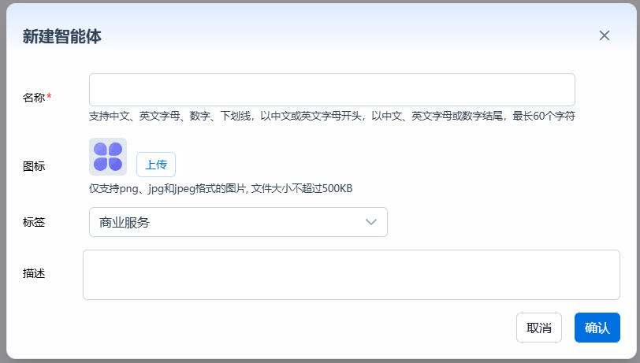
- Agent editing, you can modify the name, icon, label, and description information;
- Agent copying, copying based on existing agents;
- Agent deletion, delete existing agents;
- Agent configuration, the agent supports two configuration methods: general mode and workflow mode, 
- The configuration information of the general mode includes: model (select the model and configure the corresponding model parameters); Prompt (input the prompt word of the agent; the prompt word can be obtained from the built-in prompt word library, select it; MCP service (select the MCP service that the agent can call); tool (select the intelligent agent) Tools that can be called by the agent, and configure the corresponding tool parameters, currently supporting official tools and custom tools); knowledge base (select the knowledge base that the agent can call, and configure the corresponding parameters, the knowledge base supports multiple selections); database (select the database that the agent can call, and configure the corresponding parameters); Opening remarks and opening guide questions (after turning on the switch, the user can set an opening statement for the agent, as well as several guiding questions that he is concerned about. A maximum of 3 guiding questions can be set, and each guiding question supports a maximum length of 100 characters); Recommended questions (after turning on the switch, the agent will output up to 3 recommended questions after the conversation); 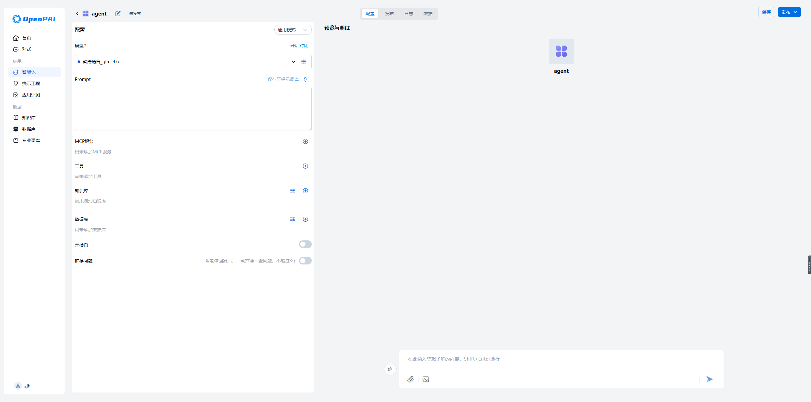 
- The agent configuration information of workflow mode includes: workflow (only supports adding one workflow); opening remarks and opening guide questions (after turning on the switch, the user can set an opening statement for the agent, as well as several guiding questions of his own concern. A maximum of 3 guiding questions can be set); recommended questions (after turning on the switch, the agent will output up to 3 recommended questions after the conversation); 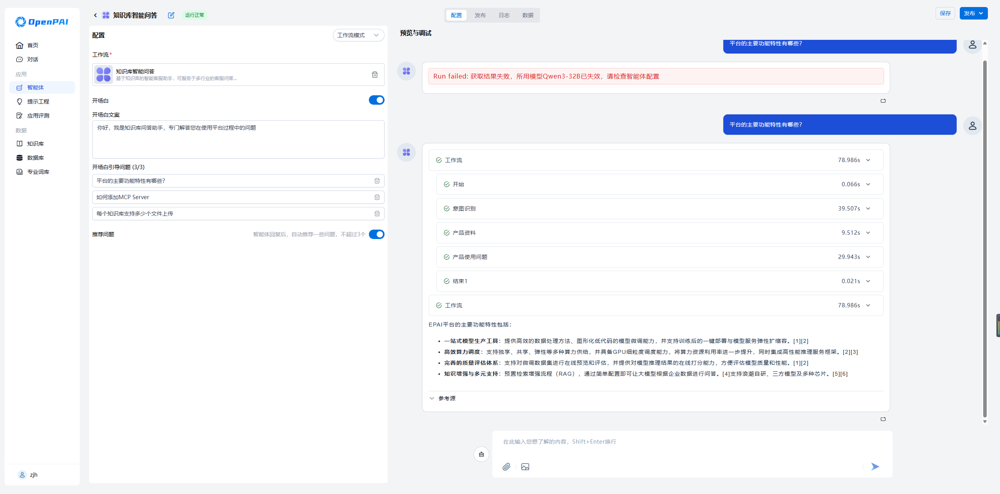
- Agent preview and debugging, viewing the effect of agent dialogue based on existing configurations; tool invocation will display tool invocation status and time consumption;
- Agent release: Release the debugged agent into a callable service. After release, it will enter the approval process. Publishing supports domain name mode and IP port number mode. In the domain name mode, you need to fill in the API address name and resource configuration (CPU, memory, and number of copies); in IP port number mode, the address is automatically generated, and the resource configuration (CPU, memory, and number of copies) can be modified manually. For published agents, there will be an "API Call" button on the details page. Click this button to view the call information. Click the "Create API KEY" button to manage user access credentials, including creation, editing, disabling, and deletion. 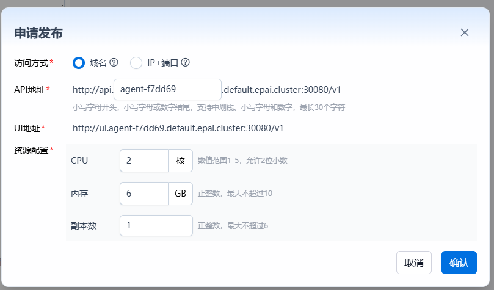
- Agent API document. For a published agent, you can view the API document of the agent on the details page;
- Agent sharing, users can share the created and published agents. The default sharing scope is only yourself. You can select some users or all users. When selecting some users, you can click the "Add" button to add users and user groups in the pop-up interface. After the addition is completed, it will be displayed on the sharing interface, and then click "Confirm" to complete the sharing;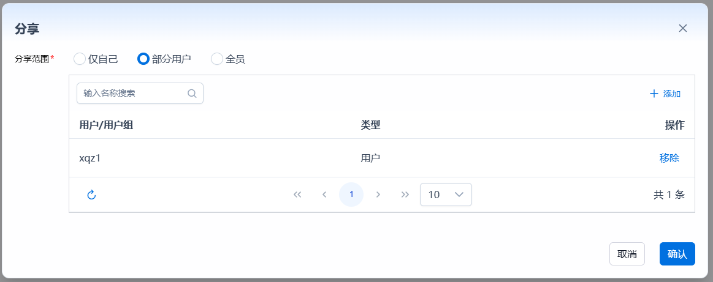
- Agent dialogue, published agents can directly open the dialogue and jump to the agent dialogue of the dialogue module;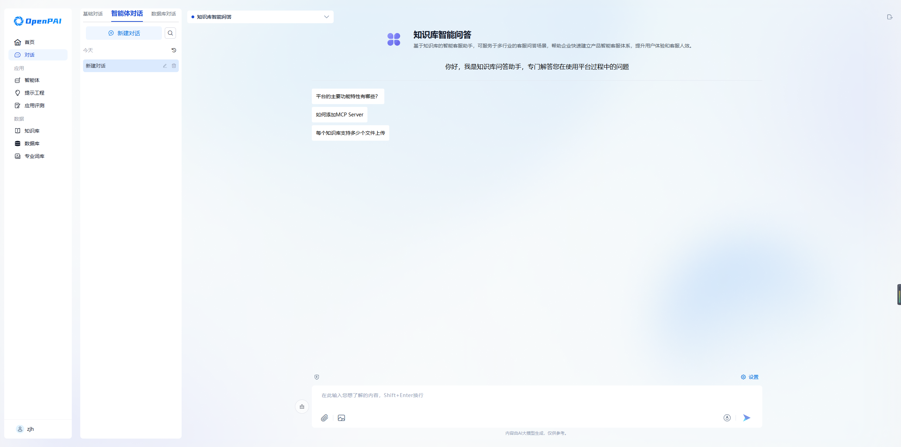
- Agent release channel. After the agent release approval is passed, the user can set whether the UI access method requires password-free, web page embedding method, corporate WeChat configuration and DingTalk robot configuration;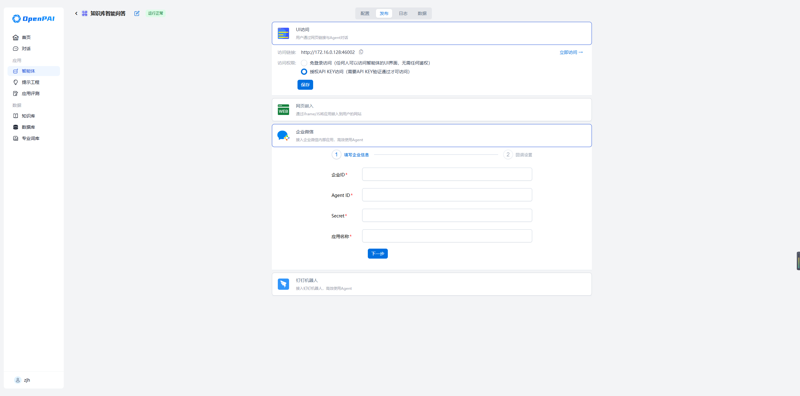
- Agent log. After the agent is released and approved, you will see the log, showing the update time, user, calling method, number of messages, content title, and creation time; the calling method includes UI access, agent dialogue, API access, enterprise WeChat, and DingTalk robot;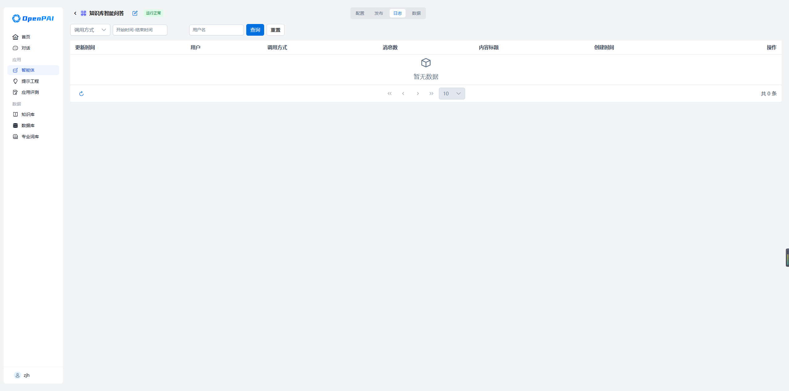
- Agent data. After the agent is released and approved, you will see the data. The displayed information includes: total number of users, total calls, total number of tokens, average response time; and graphical curve display; 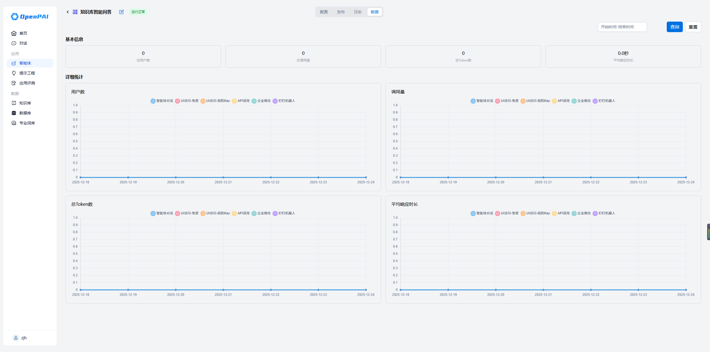
- Multi-model comparison, enter the multi-model comparison debugging page, the user can select different models and different prompt words to view the effect of the agent; the user can exit the comparison mode by selecting the better-performing model and prompt words;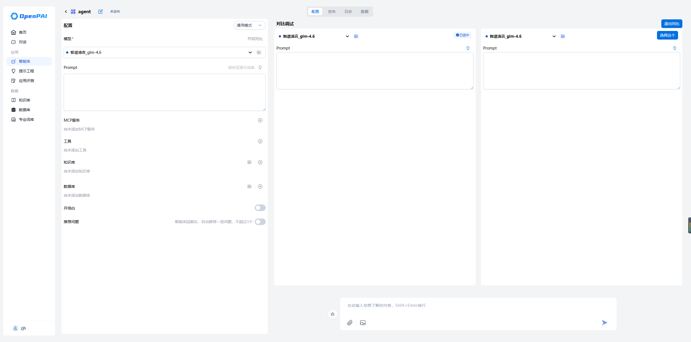
- Agent dialogue history. Users can see previous dialogue history on the debugging page, displaying the user's questions and replies; the dialogue history can be cleared;

#### 2.3.2 Worflow
- Workflow query, the display information of the workflow includes: icon, name, published/unpublished, description information, creator name, creation time; users can filter the query according to the status and name. The status can be published or unpublished, and the name supports fuzzy matching; 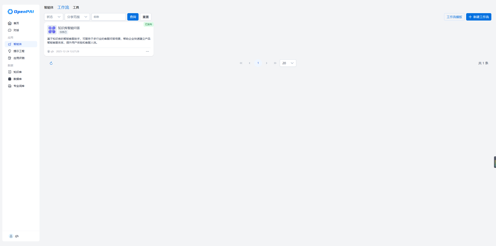
- Create a new workflow, you can create a blank workflow and create it based on a template; you can fill in the name, icon, and description information;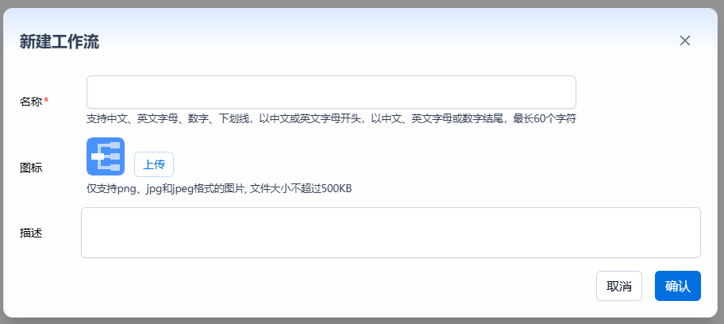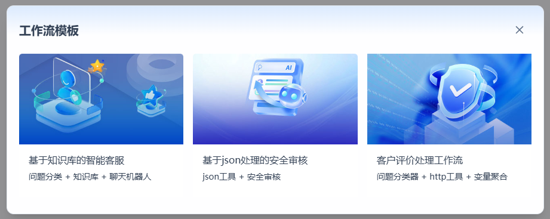
- Workflow editing, you can modify the name, icon, and description information;
- Workflow copy, copy based on existing workflow;
- Workflow deletion, delete existing workflow;
- Workflow details, select a workflow from the list, click to enter the workflow details, supported node types include: basic nodes: large model, knowledge base, database, end; logical nodes: problem classifier, conditional branch, result merging, iteration; component nodes: MCP, memory node, variable assignment, variable Volume aggregation, HTTP request, JSON processing, parameter extraction, document extractor, security audit; tool nodes: full network search, current time, string replacement, custom tools;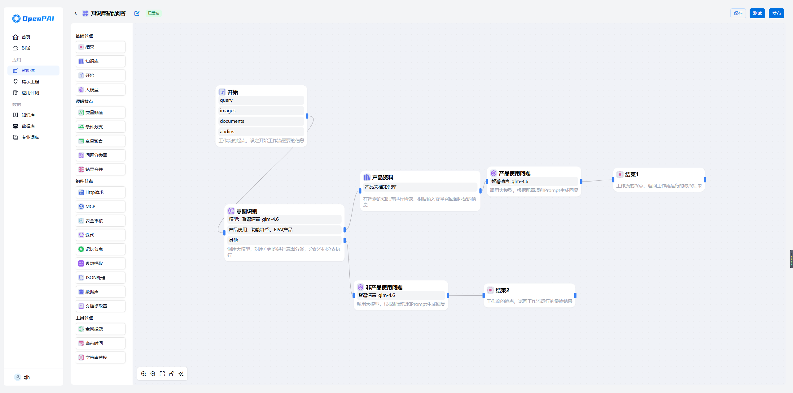
- Workflow debugging, nodes in the workflow canvas can be debugged in a single step to detect problems early; overall debugging of the workflow; the user enters questions in the dialog box; waits for the workflow answer, and finally displays the answer information in the dialog box; in the dialog box, you can see the execution status, execution time and detailed information of each node execution;
- Workflow publishing: publish the debugged workflow into a callable service. No approval is required after the workflow is published, and it becomes published directly on the workflow list page. Users can continue to modify the workflow and publish multiple times;
- Workflow conversation history, the user can see the previous conversation history on the debugging page, displaying the user's questions and replies; the conversation history can be cleared;

#### 2.3.3 Tool

Tab tool shows user's tool list used in agent or workflow.

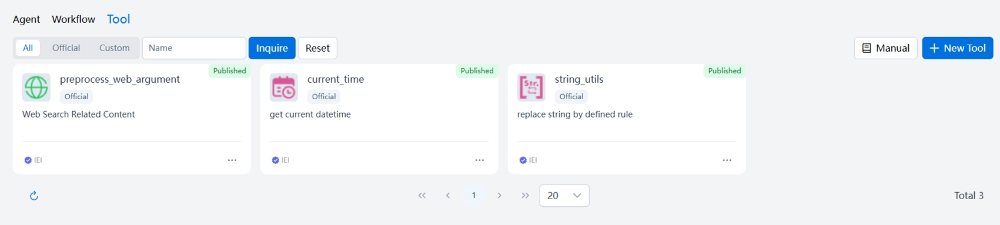

User can:

- add tool (BY **API**)
- delete tool
- edit tool

### 2.4 Prompt Management

Click the **“Prompt”** button in the **App** module to display the list of all prompts, including title, content, creator, creation time, and update time. By default, the list shows prompts created by the user and prompts shared by others.

- **Only Me**: filter and display only prompts created by the current user  
- **Search**: support fuzzy query by title or content  
- **Reset**: clear all filter conditions  
- Support sorting by title, create time, and update time  
- Support paginated display  

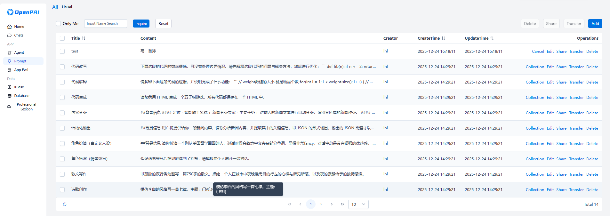

#### 2.4.1 Prompt Management

The prompt management page provides 13 preset prompts for different application scenarios, with two tabs:
- **All**: shows all prompts, ordered by creation time in descending order  
- **Usual**: shows prompts marked as favorites, ordered by the time of favoriting/editing in descending order

- **View**: hover the mouse over the prompt content to view the full text  
- **Collection**: click **Collection** to mark a prompt as commonly used; it will then appear under the **Usual** tab. Click **Cancel** to remove it from favorites  

#### 2.4.2 Add and Edit Prompt

On the **Prompt** page, click **Add** to open the **Create** dialog. Users can fill in the content according to the form; fields marked with a red asterisk are required. Click **Create** to close the dialog, and the new prompt will appear on the **Prompt Management** page.

Click **Edit** to open the edit dialog for an existing prompt. After modifying the prompt content, click **Save**. Reopening the prompt will display the updated content.

#### 2.4.3 Prompt Sharing

- **Single Sharing**

  Click the **Share** button to the right of a prompt to open the user selection dialog. After selecting target users and clicking **Confirm**, the sharing is completed. Shared users can only view and use the shared prompts; they do not have permission to perform other operations.  
  You can configure the sharing scope of each prompt. The default scope is **“Self Only”**. The sharing scope can be **“Specific Users”** or **“All Users”**. When **“All Users”** is selected, the prompt is shared with all users.

  When **“Specific Users”** is selected, the prompt is shared with specific users or user groups. The initial sharing list is empty, meaning it is not shared with anyone. Click **Add** to open the add-user page, where all user groups and all users under the current user’s groups are displayed; you can share with user groups or individual users. After confirmation, you return to the sharing page and can see the selected users or user groups and remove any of them if needed. Click **Confirm** on the sharing page to take effect.

- **Batch Sharing**

  Batch sharing is supported: on the list page, select multiple prompts and click the **Share** button to enter the sharing page. When performing batch sharing, all existing sharing records of the selected prompts will be cleared and replaced by the latest sharing configuration. Please pay attention to this behavior when using batch sharing.

#### 2.4.4 Prompt Ownership Transfer

- **Single Transfer**

  **Transfer** means transferring ownership, equivalent to changing the creator. Click the **Transfer** button to the right of a prompt to open the target user selection dialog. You can select a user from the list or search by name and select a user from the search results. Click **Confirm** to complete the transfer. The target user will then have full permissions on the prompt.

- **Batch Transfer**

  Select the prompts to be transferred, then click the **Transfer** button above the list to open the target user selection dialog. After selecting the target user and clicking **Confirm**, the batch transfer is completed. The target user will have full permissions on the transferred prompts.

#### 2.4.5 Prompt Delete

- **Single Delete**  
  Click the **Delete** button to the right of a prompt created by the current user. A confirmation dialog will pop up. Click **Yes** to complete the deletion, and the prompt will be removed from the list.

- **Batch Delete**  
  Select the prompts to be deleted, then click the **Delete** button above the list. A secondary confirmation dialog will pop up. Click **Yes** to complete the batch deletion.

### 2.5 App Eval Management

On the homepage, you can click on the 'Application Review' submenu under 'Applications' to enter the application review module.

#### 2.5.1. Evaluation set management
The evaluation set management page allows users to view the evaluation set list, preview questions, download templates, upload files, modify, delete, and share information.

#### 2.5.2. Evaluation task
There are three types of evaluation tasks: dialogue only, manual evaluation, and batch evaluation.
- Only dialogue tasks are supported, and only multi-mode dialogues are supported.
- The manual evaluation task supports both multi-modal dialogue and manual scoring.
- Batch evaluation task, generate answers in batches based on the selected evaluation set of questions. Default support for manual scoring, optional auxiliary scoring; The number of answer generation options is [1,4] times, with a default of 1 time; Select an available review set and enter the number of questions (the maximum number of questions is controlled by the number of questions per task on the administrator system settings page).

The evaluation objects are divided into three categories: selecting models, selecting intelligent agents, and accessing services. The number of evaluation objects is limited to [1,4].
- Select Model
Required model and configure model parameters;
Required object name, defaults to model name, and supports modification;
Optional tools and configure tool parameters.

- Select intelligent agent
Required intelligent agent;
Required object name, default to intelligent agent name, and supports modification;
Required API KEY.

- Access service
Required service address that supports openai format output;
Required object name (no default value);
Required API name;
Select api_key and configure the parameter information supported by the service;
Required model name (corresponding to the model parameter of the service).

Task list display: task name, task type, evaluation object, evaluation set (only dialogue tasks and manual evaluation tasks, no evaluation set, displayed as "--"; batch evaluation tasks, displayed as evaluation set name), number of questions (displayed as the number of questions asked), task status and task operation (specific status and operation will be detailed in the task types below).
- Task status: No task status, displayed as "--"; Task operations: including evaluation reports, copying, and deleting.
- Task status and task operation: create a new task, can be copied or deleted; Generating, replicable and deletable; Manual scoring, can be copied or deleted; Completed, review report can be viewed, copied or deleted.
- Task status and task operations: queued, can be copied or deleted; During generation, it can be paused, continued, copied, or deleted; Manual scoring, can be copied or deleted; Auxiliary scoring, can be paused, continued, copied, or deleted; Paused, can be copied or deleted; Paused, can be copied, can continue, can be deleted; Completed, review report can be viewed, copied or deleted.

### 2.6 KBase Management

A knowledge base enables Retrieval-Augmented Generation (RAG) to enhance large model inference. Users can click on the [Knowledge Base] navigation menu on the left side to enter the knowledge base page, where they can create and manage their own knowledge bases. Documents can be uploaded to the knowledge base, and documents of different formats are processed uniformly for easy management. Currently, the knowledge base menu includes three tabs: [Knowledge Base], [All Documents], and [Retrieval Testing].

#### 2.6.1 Knowledge Base Directory Management
The knowledge base introduces the concept of directory hierarchy, allowing users to create directories at different levels and create knowledge bases under directories at different levels. In the Knowledge Base tab, the left side displays a directory tree structure of the knowledge base.

##### 2.6.1.1 Directory List
The top-level directory is [All], which is divided into two root directories: [Shared by Others] and [Knowledge Directory]. As the names suggest, the [Shared by Others] directory contains knowledge bases shared or made public by other users, while the [Knowledge Directory] contains knowledge bases created by the current user.

##### 2.6.1.2 Directory Creation
Currently, subdirectories can be created under [Knowledge Directory], with a default support for creating 7 levels of subdirectories. Each directory level can contain no more than 100 subdirectories at the same level. These default parameters can be modified by administrators in system settings. The [Shared by Others] directory does not support creating subdirectories.

##### 2.6.1.3 Directory Modification
Users can modify subdirectories created under [Knowledge Directory], including changing the directory name and parent directory. Changing the parent directory achieves the effect of moving the directory. Root directories cannot be modified.

##### 2.6.1.4 Directory Deletion
Users can delete subdirectories created under [Knowledge Directory]. When a directory contains subdirectories, it cannot be deleted. When a directory contains knowledge bases, deleting the directory will move the knowledge bases up one directory level by default. Root directories cannot be deleted.

#### 2.6.2 Knowledge Base Management

##### 2.6.2.1 Knowledge Base List
This UI interface displays all knowledge base lists that users can access, including those created by themselves, shared with them, and publicly available document knowledge bases and question-answer knowledge bases. Information displayed for each knowledge base includes: name, type, language, keywords, description, parent directory, sharing scope, permissions, creator, creation time, document count, size, and operations. Retrieval and filtering by knowledge base type, language, and name are supported. Knowledge base types include document knowledge bases and question-answer knowledge bases; knowledge base languages include Simplified Chinese, Chinese-English, Japanese, Korean, and multilingual.

In the list view, sorting by name, creation time, document count, and size in ascending and descending order is supported. Operations such as sharing, transferring, deleting, and merging knowledge bases can be performed on selected knowledge bases, and all operations support batch processing.

##### 2.6.2.2 Built-in Knowledge Base
Each user has a built-in knowledge base named [Q&A Favorites]. On the regular conversation page, when you select a conversation and click the favorite button below the model's response, it automatically syncs to the Q&A Favorites knowledge base. This knowledge base does not support name modification, sharing, transferring, deletion, or merging operations.

In the Q&A Favorites knowledge base, only Q&A pairs collected from the conversation page are allowed to sync to the knowledge base. There is no document parsing upload function, and users cannot manually add Q&A pairs.

Additionally, on the Shared by Others page, there is a built-in knowledge base named [Product Documentation Knowledge Base] that is shared across all users. Regular users can directly use this knowledge base for Q&A testing, and can also use question-answer templates in agents based on the knowledge base. The template defaults to using [Product Documentation Knowledge Base]. Note that this is a built-in knowledge base and does not support name modification, sharing, transferring, deletion, or merging operations.

##### 2.6.2.3 Creating a New Knowledge Base
Click the "Create Knowledge Base" button to enter the knowledge base creation interface and fill in the following information:

Select the knowledge base type: [Document Knowledge Base] or [Question-Answer Knowledge Base]

Enter the name of the knowledge base. The knowledge base name should comply with the prompts shown on the UI and can be modified later. Knowledge base names cannot be duplicated for the same user.

Select the knowledge base language. The language option represents the primary language of the document content. The default is Simplified Chinese, with options including Simplified Chinese, Chinese-English, Japanese, Korean, and multilingual. Note that different languages correspond to different encoding models. If the language of the uploaded documents does not match the knowledge base language setting, parsing will fail. Once the knowledge base language is set, it cannot be changed. Please note this carefully.

Enter the knowledge base description (optional, can be left blank).

Select the parent directory.

Enter knowledge base keywords (can be left blank).

Click "Complete Creation" to return to the card list page. Click "Create and Upload Files" to go directly to the document upload page.

##### 2.6.2.4 Editing a Knowledge Base

On the knowledge base list page or knowledge base card page, click the [Edit] button to enter the knowledge base editing page. On the editing page, you can modify the name, description, parent directory, and keywords information.

##### 2.6.2.5 Knowledge Base Configuration

Click on Knowledge Base to enter the Knowledge Base details page.

The Document Knowledge Base has two tabs: File Management and Setting;

The Question and Answer Knowledge Base has three tabs: File Management, Question List, and Setting;

Clicking the Configuration tab allows you to edit the knowledge base's configuration of analysis, chunking, storage, and search.

 (1) Analysis Configuration

**Language Detect**: Enabling this button will cause the backend to check if the language of the parsed document matches the knowledge base's language configuration; if they do not match, parsing will fail and an error message will be displayed; when disabled, the backend will no longer check the language of the parsed document and will directly use the language-setting of the knowledge base for processing. It should be noted that this configuration only takes effect when the "**Precision Priority**" is selected during PDF file parsing. This configuration has no effect when "Speed Priority" or "VLM(Visual Language Model)" is selected.

**Parsing Strategy**: PDF file parsing offers three strategies: "**Accuracy Priority**," "**Speed Priority**," and "**VLM**." Only one strategy can be selected during parsing; the default is "Accuracy Priority Strategy." This configuration can be modified after PDF parsing.

1) When "Accuracy Priority" is selected, the background uses a pipeline of components such as layout detection, formula recognition and detection, table recognition, and text recognition for PDF parsing. This results in high accuracy, strong versatility, and faster parsing speed when deployed on GPUs. When this configuration is selected, there are two sub-configuration options: "Photocopies" and "Formula Recognition."

   

- Enabling the "Photocopies" button uses an OCR model for text recognition in the background. It is recommended to select this configuration for photocopy PDFs. The backend automatically determines whether the PDF document is a photocopy when Disabling the "Photocopies". If it is not a photocopy, it uses Python library functions to directly extract text from the PDF, resulting in faster parsing. However, automatically determining whether a PDF document is a photocopy is not 100% accurate. If you are certain it is a photocopy, it is recommended to directly select this button. This configuration is disabled by default.
- Enabling the "Formula Recognition" button will cause the background to call a formula detection model to check if there are formulas in the PDF file. For PDF files with formulas, or if you are unsure whether there are formulas, it is recommended to select this button. If you are certain there are no formulas in the PDF, disable this configuration option, which will improve parsing speed. This configuration is enabled by default.

2) When selecting the "Speed Priority," the background calls smaller-scale layout detection and text recognition models for parsing, resulting in slightly lower accuracy, but faster parsing speed when deployed on CPU. When this configuration is selected, there is a selectable sub-configuration option: "Photocopies."

- Enabling the "Photocopies" button uses an OCR model for text recognition in the background. It's recommended to select this configuration for photocopied PDFs. Disabling the "Photocopies" button allows the background to directly extract text from the PDF using Python library functions, resulting in faster parsing. If you are certain it's a photocopy PDF, it's recommended to select this button directly. This configuration is disabled by default.

3) Selecting "VLM(Visual Language Model)" uses a visual language model for PDF parsing, resulting in higher parsing accuracy and handling PDFs with complex formats and multiple languages (Chinese, English, Japanese, Korean). However, it requires more resources and is slightly slower; it's recommended for GPU deployments.

**Image Comprehension**: Enabling this configuration uses an AI model to accurately understand image content, which takes more time.

 (2) Chunking Configuration

Chewing strategies include **general chunk** and **multi-level chunk**. General chunk is used by default.

**General Chunk**: The system splits the content into independent chunks according to user-defined rules. When the system retrieves a chunk for question-answering, the content of the chunk will be returned as the context.

This configuration has only one parameter:

**Chunk Size**: The limit on the number of chunk tokens after splitting a long text into multiple chunks; the value range is 0-1000, with a default of 128.

**Multi-level Chunk**: The multi-level chunk uses a two-tier data structure to balance the search accuracy and context information. When answering questions, the system retrieves the second-level chunk, but the first-level content will be returned, which can provide richer context.

This configuration has two parameters:

**Second-level chunk size**: The limit on the number of second-level chunk tokens after splitting a long text into multiple chunks; Its value range is 0-1000, with a default of 128.

**First-level chunk size**: The limit for the first-level-chunk tokens. Each first-level chunk contains multiple second-level chunk; The second-level chunk is used in searching , but the first-level chunk  will be returned for question answering; Its value range 512-4096, default 1024.

(3) Knowledge Base Indexing Configuration

- Indexing Parameters: Encoding Model (Embedding Model)

    Note: This content can only be modified when documents have not been parsed. If there are already successfully parsed documents or documents in the parsing queue, the indexing parameters cannot be modified.

The encoding model can be selected from: bce-embedding-base_v1, bge-m3, or Yuan-embedding-1.0. You can choose the appropriate encoding model based on the content requirements of your documents.

    - bce-embedding-base_v1: Excels in bilingual Chinese-English and cross-lingual semantic representation capability, with vector dimension of 768. BCE-Embedding is an open-source model released by NetEase Youdao, specifically optimized for RAG scenarios in various domains such as education, law, finance, and healthcare.
    - bge-m3: Released by the Beijing Academy of Artificial Intelligence, supports multiple languages including Chinese, English, Japanese, and Korean, with excellent capabilities in multilingual and cross-lingual representation and retrieval. Supports input text length up to 8192, with vector dimension of 1024.
    - Yuan-embedding-1.0: Specifically designed to enhance Chinese text retrieval capability. The default vector dimension is 1792, with excellent performance across multiple domains such as healthcare, news, and encyclopedic knowledge. Compared to other models of the same scale, it often has better retrieval precision and recall.

(4) Knowledge Base Retrieval Configuration

Retrieval Parameters: Include: number of results, retrieval type (hybrid retrieval, keyword retrieval, vector retrieval), recommended weights for each retrieval type, and similarity threshold.

Hybrid Retrieval: Uses both keyword query and vector query methods for querying, employing multi-path recall. Query results and the question are analyzed using relevance algorithms and ranked by relevance score from highest to lowest.

Keyword Retrieval: Also called full-text retrieval, performs matching queries based on keywords only. Keyword extraction algorithms are used to extract keywords from both knowledge segments and user questions, then retrieval is performed based on these keywords.

Vector Retrieval: Analyzes the semantic vector of user questions and queries semantically related knowledge segments from the knowledge base. It can understand the semantics of query content and perform similarity queries, supporting multimodal queries with strong error tolerance.

    Note: Different retrieval strategies correspond to different knowledge base languages. Chinese and Chinese-English: default to hybrid retrieval, with options to select other retrieval methods. Japanese, Korean, and multilingual: default to vector retrieval and cannot be changed. Detailed parameter descriptions can be found in the "Retrieval Testing" section.

##### 2.6.2.6 Deleting a Knowledge Base
Deleting a knowledge base will delete both the knowledge base and the documents within it. Users can only delete knowledge bases they have created. They do not have deletion permissions for knowledge bases shared with them or those for which they have public access.

##### 2.6.2.7 Knowledge Base Sharing
Through the knowledge base sharing operation, you can share knowledge bases created by you with other users or user groups, and assign different permissions to different users or user groups. For regular users, there are two access points for knowledge base sharing: one is on the knowledge base card page where you can select a knowledge base, click the dropdown menu under knowledge base operations, and find the share button; the other is on the knowledge base list page where there is a share button in the operations column. Both lead to the knowledge base sharing page. Administrator users can also perform sharing operations on all knowledge bases from the knowledge base page.

After entering the knowledge base sharing page, you can select the sharing scope and permissions. The default scope for each knowledge base is [Only Self], with options for Only Self/Specific Users/All Users. Permissions can be either View Query or View Content. View Query means the user can only use the knowledge base without viewing document contents. View Content means the user can both use the knowledge base and view its document contents.

When the sharing scope is set to [Only Self], it means the knowledge base is not shared with other users, and the creator has all permissions for the knowledge base.

When the sharing scope is set to [All Users], it means the knowledge base is shared with all users. The default permission is [View Content], but you can modify it according to your needs.

When the sharing scope is set to specific users, it means the knowledge base is shared with particular users or user groups. The initial sharing list is empty, indicating no users have been granted access. Click the [Add] button to open the add users page, which displays all user groups and all users in the current user's group. You can share with either user groups or individual users, with the default permission being View Content, and options for View Query and View Content. After confirmation, you return to the sharing page where you can see the selected users or groups and their permissions. You can remove selected users/groups. Click Confirm on the sharing page to apply the sharing operation.

Sharing supports batch operations, allowing you to select multiple knowledge bases on the list page and click the share button to enter the sharing page. When performing batch sharing, the original sharing records of the selected knowledge bases will be cleared, with the latest sharing records taking effect. Therefore, if you perform batch sharing, please note this carefully.

After the sharing operation takes effect, shared users/group members can see the corresponding knowledge bases in the Knowledge Base - Shared by Others directory and can view them through the knowledge base list. Based on different sharing permissions, they can see their permission scope for that knowledge base.

##### 2.6.2.8 Knowledge Base Ownership Transfer
Through the knowledge base ownership transfer operation, you can transfer knowledge bases you have created to other users. The access points for knowledge base ownership transfer for regular users are similar to those for knowledge base sharing. Please refer to the [Knowledge Base Sharing] section for details.

After entering the knowledge base ownership transfer page, you can choose to transfer to a group member or specify a user.

When selecting a group member, you can choose one user from the group member list to perform the transfer.

When specifying a user, directly input the username. The system will verify whether the username exists and whether the transfer is possible.

Transfer supports batch operations, allowing you to select multiple knowledge bases on the list page and click the transfer button to enter the transfer page.

After the transfer operation takes effect, the receiving user can see the corresponding knowledge base under [Knowledge Directory] in the Knowledge Base. The transfer function does not affect the original sharing scope of the knowledge base. If a knowledge base is transferred after being shared with other users, it does not affect other users' access permissions.

##### 2.6.2.9 Merging Knowledge Bases
Users can select two or more knowledge bases of the same type that they have created and merge them. During merging, you need to set the new knowledge base name, language, and parent directory. You can also enter keywords and description. The other configurations of the merged knowledge base will be the same as the first selected knowledge base. The new knowledge base will import documents from the original knowledge bases. If documents in the original knowledge bases have been parsed or are pending parsing, the corresponding documents in the new knowledge base are added to the parsing queue; otherwise, they remain in an unparsed state. The information and documents in the original knowledge bases remain unchanged.

##### 2.6.2.10 Splitting a Knowledge Base
Users can select files from a knowledge base to split off as a new knowledge base. During splitting, you need to set the new knowledge base name, language, and parent directory. You can also enter keywords and description. The other configurations of the split knowledge base will be the same as the original knowledge base. Selected documents will be imported into the new knowledge base. If documents in the original knowledge base have been parsed or are pending parsing, the corresponding documents in the new knowledge base are added to the parsing queue; otherwise, they remain in an unparsed state. The information and documents in the original knowledge base remain unchanged.

#### 2.6.3 Document Management

##### 2.6.3.1 Uploading Documents
When creating a [Document Knowledge Base], click on the knowledge base to enter the knowledge base details page, which has 2 tabs: File Management and Configuration. Click the File Management tab to upload documents. Currently supported formats include: pdf, docx, doc, txt, html, htm, md, json, jsonl, epub, mobi, xml, pptx, chm, xlsx, jpeg, jpg, and png. For a single upload, the total document size cannot exceed 500MB, with a maximum of 200 files. Upload progress can be viewed during the upload process. The default capacity for a single knowledge base is 500 documents, which can be modified by administrators in the system settings page.

On the import document page, you can check [Auto Start Parsing Upon Import Complete], which is enabled by default. This means documents are parsed immediately after successful upload without requiring manual parsing triggers on the document management page.

    [Note]: File names cannot exceed 80 characters, otherwise parsing may fail.

Two import methods are supported: local file import and SFTP server import.

###### 2.6.3.1.1 Local File Import
Local file import supports selecting multiple files and selecting folders for import. This is illustrated using [Document Knowledge Base] as an example:

###### 2.6.3.1.2 SFTP Server Import
SFTP server import requires users to fill in server address, port, file directory, and authentication information. Authentication methods include both username + password and username + secret key.

After SFTP import, document upload operations are performed in the backend. You can view background tasks on the document management page.

After clicking View, you enter the task details page, which displays task number, server address, port, file directory, total number of files, task progress, number of imported files, task status, and currently importing files.

When the task completes, progress reaches 100% and the status is also updated accordingly.

When creating a [Document Knowledge Base], click on the knowledge base to enter the knowledge base details page, which has 2 tabs: File Management and Configuration. Click the File Management tab to upload documents. Currently supported formats include: pdf, docx, doc, txt, html, htm, md, json, jsonl, epub, mobi, xml, pptx, chm, xlsx, jpeg, jpg, and png.

When creating a [Question-Answer Knowledge Base], click on the knowledge base to enter the knowledge base details page, which has 3 tabs: File Management, Question List, and Configuration. Click the File Management tab to upload documents. Currently supported formats are xlsx and csv, with a single upload not exceeding 500MB and a maximum of 200 files. The import document page for [Question-Answer Knowledge Base] supports template download. You should edit your files according to the template before uploading. Upload progress can be viewed during the upload process:

[Template Download] downloads an faq_template.csv format document containing two columns: Question column and Answer column. When using Q&A knowledge base document parsing, you must construct your documents according to this template format with both question and answer columns; otherwise, parsing will fail.

##### 2.6.3.2 File Management
When creating a [Document Knowledge Base], in the list view, sorting by name, file size, and update time in ascending and descending order is supported. Filtering and querying by name and document status is supported.

When creating a [Question-Answer Knowledge Base], in the list view, sorting by document name, file size, and update time in ascending and descending order is supported. Filtering and querying by name and document status is supported. The page includes functions for splitting the knowledge base, parsing, canceling parsing, deleting, and importing documents.

##### 2.6.3.3 Document Parsing
Document parsing refers to parsing the specific content of documents, extracting text and chunking it. Text chunking is also called "knowledge". This creates a three-tier knowledge system: knowledge base - document - knowledge.

After successful document upload, parsing all files and parsing selected files are supported. Batch cancellation of parsing is also supported. During the parsing process, you may see queuing. If parsing fails, the failure reason will be displayed in the status. Documents that fail to parse can be re-parsed, but successfully parsed documents cannot be parsed again to avoid wasting platform resources.

##### 2.6.3.4 Viewing Parsing Results
After knowledge base document parsing is successful, click [Parsing Results] to enter the parsing results viewing interface. Parsing results are displayed in pages as follows:

Click on the thumbnail to view chunk content in its source file location;

Click on each chunk content to locate its page number in the source file, making it convenient for viewing;

After parsing is complete, the document will automatically complete knowledge encoding and database storage according to the configuration parameters of its knowledge base.

##### 2.6.3.5 Parsing Results Operations
Parsing results operations include:

- Enabling/Disabling knowledge chunks: Disabled chunks will not appear in retrieval results;
- Editing knowledge chunks: Users can modify the text content of knowledge chunks;
- Batch operations: Batch enable, disable, or delete knowledge chunks;
- Adding knowledge chunks: Users can add new chunks to the document for knowledge base retrieval;
- Replace All: If some parsing results are inaccurate, users can use the Replace All function to replace all inaccurate content in the parsed chunks. [Original Content] length limit: 1-100 characters; [Replace With] length limit: 0-100 characters.

##### 2.6.3.6 Question List - Question-Answer Knowledge Base
Enter the question-answer knowledge base details page, which has 3 tabs: File Management, Question List, and Configuration. Click the [Question List] tab to display all question information in this knowledge base, including: question, answer, source document, character count, and update time.

You can sort by question, character count, and update time in ascending or descending order. You can edit each question, add new questions, and batch delete questions.

Click the edit button to modify the question and answer. Question length limit: 1-100 characters; Answer length limit: 1-1000 characters.

#### 2.6.4 All Documents

##### 2.6.4.1 Document List
Regular users click on the [Knowledge Base] menu to enter the knowledge base page and click the [All Documents] tab to display all knowledge bases created by that user, documents uploaded in conversations, and documents from public knowledge bases. The list displays information including: name, upload time, document size, creator, source, status, chunk count, and operations. Sorting by name, upload time, and creator in ascending or descending order is supported. Querying by name and filtering by status is supported. You can check [View Only My Documents] and click the query button to filter documents uploaded by the user. In the operations column, users can delete their own documents, with batch deletion supported.

##### 2.6.4.2 Reference Navigation
Click on a document to display a dropdown menu showing the document's reference information in conversations. Clicking on a specific record jumps to the reference location in the corresponding conversation.

#### 2.6.5 Retrieval Testing

##### 2.6.5.1 Retrieval Testing
Regular users click on the [Knowledge Base] menu to enter the knowledge base page and click the [Retrieval Testing] tab. From the retrieval scope, select knowledge bases created by the user with non-empty content (must contain either successfully parsed documents or manually added Q&A pairs). In the retrieval settings, configure the retrieval strategy, number of results, and similarity threshold. You can perform retrieval testing on documents in the selected knowledge bases to quickly verify document chunking and retrieval effectiveness. Select an appropriate retrieval strategy (hybrid retrieval, keyword retrieval, vector retrieval), set weights, set an appropriate similarity threshold, add test text, and the system will retrieve the most relevant text blocks from the knowledge base.

Retrieval result display includes: document name, page number, similarity, semantic similarity, keyword similarity, content thumbnail, and content text;

In the retrieval results, if you want to modify text blocks, you can click the [Edit] button next to the text block to edit it. Updated results will automatically sync to the text block list in the knowledge base.

After testing, if you feel the retrieval parameters are appropriate, you can click the [Sync] button to save this configuration information to the knowledge base configuration.

The retrieval process consists of two stages: coarse ranking and fine ranking.

The coarse ranking stage primarily removes text that does not meet criteria and returns the first stage retrieval results. In the fine ranking stage, further similarity calculations are performed based on coarse ranking results to obtain qualified text results.

- Number of Results: Represents the final recall results, returning the top N text blocks ranked by combined similarity score.
- Retrieval Type: Includes three types: [Hybrid Retrieval] [Keyword Retrieval] [Vector Retrieval], with each type having additional parameters.

  [Hybrid Retrieval]: Combines keyword similarity and vector cosine similarity. The keyword similarity weight defaults to 0.2. Hybrid similarity score = α × keyword similarity score + (1-α) × semantic similarity score.

  [Keyword Retrieval]: Uses only keyword similarity, with keyword similarity weight defaulting to 1. This is transparent to users.

  [Vector Retrieval]: Uses only vector cosine similarity, with keyword similarity weight defaulting to 0. This is transparent to users.

- Hybrid Similarity Threshold: Uses hybrid similarity score to evaluate the distance between two text segments. It is a weighted combination of keyword similarity and vector cosine similarity. If the similarity between a query and a chunk falls below this threshold, the chunk will be filtered out. The hybrid similarity threshold defaults to 0.5.

- Keyword Similarity Weight: The keyword similarity weight range is [0,1], and the sum of keyword similarity weight and semantic (vector) similarity weight equals 1.0. [Keyword] and [Semantic] here represent keyword similarity weight and vector similarity weight respectively.

    > Note: If uncertain, use the default parameters.

You can adjust parameters based on your specific situation. The following are parameter adjustment scenarios:
1. When the text to be retrieved contains many similar texts, you can appropriately increase the [Hybrid Similarity Threshold] to retrieve higher similarity text segments.
2. When you prefer to use keywords to filter text, you can directly use [Keyword Retrieval]. Conversely, when you prefer to use semantics to retrieve text, you can directly use [Vector Retrieval].
3. When the user's questions relate more to keywords with your document content, that is, keywords are few but precise, you can increase the [Keyword Similarity Weight] or try [Keyword Retrieval].
4. When the user's questions and document content clearly have no keyword connection but have semantic similarity, try to use [Vector Retrieval] or reduce the [Keyword Similarity Weight].
5. When the knowledge base language is set to Japanese or Korean, [Vector Retrieval] is used by default and cannot be changed.

### 2.7 Database Management

The database connection management interface allows users to view the list of database connections created by themselves or shared by others. The list displays details including connection name, database type, database name, server address, port, creator, sharing scope, and connection time. Users can filter database connections by the criteria of Only Me, connection type, connection name, and creator.

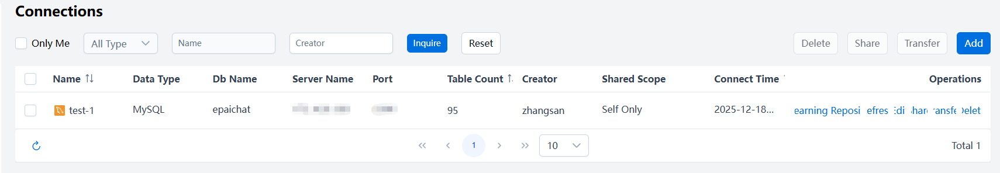

Users can add a database connection via the **Create Database Connection** function. They need to select the database type (supported types include MySQL, PostgreSQL, MariaDB, SQL Server, Oracle, and Dameng), and fill in the connection name, server address, port, username, password, and database name. After confirmation, the system will perform a connection test using the selected database type and the entered server address, port, username, password, and database name. If the database connection fails, the creation will be aborted; if the connection succeeds, the creation will be completed. Once created, the platform will automatically retrieve the table information of the database. Users can view the newly created database connection by refreshing the list.

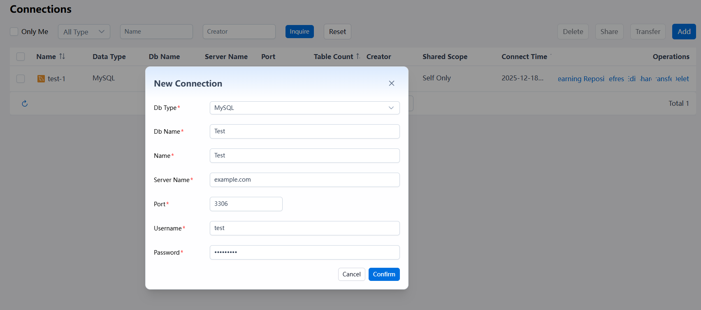

When the number of tables in a user's database changes, the user can use the refresh function to update the table count for the corresponding database connection. The creator of a database connection can share the connection with other users, and can specify to share it with all users or specific users. For specific users, the connection can be shared with designated users or user groups. The shared users can view the connection in their connection list and use it for database conversations. The transfer function is used to transfer a specified database connection to another user. During the transfer, the target user list displays all users. After the transfer, the creator of the database connection will be updated to the new user.

The data in the AI Learning Respositiry is used to provide prompts for large models during conversations, which can improve the accuracy of the models' responses. Users can view the learning respositiry data corresponding to the database and add their own learning data through the add function.

AI Learning The data in the AI Learning Respositiry data is divided into three types: SQL QS, Terminology, DDL .SQL QS includes question descriptions and their corresponding SQL answers.Terminology refers to descriptive language that characterizes the database, where users can fill in information related to the database structure, usage scenarios, and more.DDL  consists of SQL statements for creating or modifying data tables in the database. When a database is added, the system automatically reads the table creation statements in the database and adds them to the learning library. Users can  delete, or add to this part of the data.

### 2.8 Professional Lexicon Management

Click the **“Professional Lexicon”** button under the **Data** module to display the list of all lexicons, including name, category, description, sharing scope, word count, creator, creation time, and update time. By default, the list shows all lexicons created by the user and those shared with the user by others.

- **Only Me**: filter to show only lexicons created by the current user  
- **Inquire**: support combined filtering by category, sharing scope, and fuzzy search by name  
- **Reset**: clear all filter conditions  
- Support sorting by name, creation time, and update time  
- Support paginated display  

**Note**: The maximum number of lexicons a user can create is limited by the system parameter **“Maximum Wordbase per User Can Create”**.

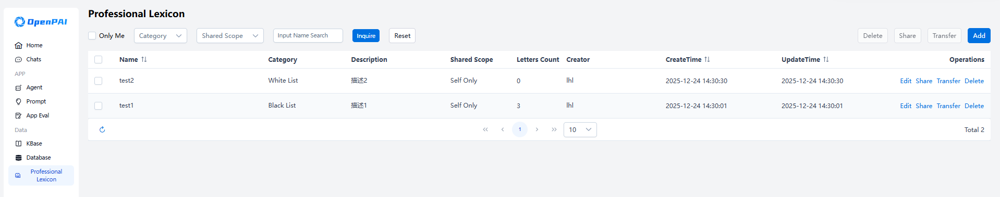

#### 2.8.1 Add and Edit Lexicon

On the **Professional Lexicon** page, click **Add** to open the create-lexicon dialog. Users can fill in the content according to the form; fields marked with a red asterisk are required.  
- **Name**: required, up to 10 characters  
- **Category**: required, default is **Black List**, and can be changed according to actual needs  
- **Description**: optional, up to 100 characters  

Click **Create** to close the dialog and display the newly created lexicon in the list.

Click **Edit** to open the edit dialog for an existing lexicon. You can modify the name, category, and description. After editing, click **Save**, and the next time you open it, the updated content will be displayed.

#### 2.8.2 Lexicon Sharing

- **Single Sharing**

  Click the **Share** button to the right of a lexicon to open the lexicon sharing page, where you can configure the sharing scope. The default scope of each lexicon is **“Self Only”**. The sharing scope can be **“Specific Users”** or **“All Users”**. When **“All Users”** is selected, the lexicon is shared with all users.

  When **“Specific Users”** is selected, the lexicon is shared with specific users or user groups. The initial sharing list is empty, meaning it is not shared with anyone. Click **Add** to open the add-user page, where all user groups and all users under the current user’s groups are displayed; you can share with user groups or individual users. After confirmation, you return to the sharing page and can see the selected users or user groups and remove any of them if needed. Click **Confirm** on the sharing page to take effect.

- **Batch Sharing**

  Batch sharing is supported: on the list page, select multiple lexicons and click the **Share** button above the list to enter the sharing page. When performing batch sharing, all existing sharing records of the selected lexicons will be cleared and replaced by the latest sharing configuration. Please pay attention to this behavior when using batch sharing.

  After the sharing operation takes effect, all shared users or members of shared user groups can see the corresponding lexicons in the Professional Lexicon module.

#### 2.8.3 Lexicon Ownership Transfer

- **Single Transfer**

  **Transfer** means transferring ownership, equivalent to changing the creator. Click the **Transfer** button to the right of a lexicon to open the target user selection dialog. You can select a group member or specify a user account to select a specific user. After selecting the target user and clicking **Confirm**, the transfer is completed, and the target user will have full permissions on the lexicon.

- **Batch Transfer**

  Select the lexicons to be transferred, then click the **Transfer** button above the list to open the target user selection dialog. After selecting the target user and clicking **Confirm**, the batch transfer is completed, and the target user will have full permissions on the transferred lexicons.

  The transfer operation will not affect the original sharing scope of the lexicons; that is, if a lexicon has already been shared with other users, transferring its ownership will not affect other users’ permissions to view or use the lexicon.

#### 2.8.4 Lexicon Deletion

- **Single Deletion**  
  Click the **Delete** button to the right of a lexicon created by the current user. A confirmation dialog will pop up. Click **Yes** to complete the deletion, and the lexicon will be removed from the list.

- **Batch Deletion**  
  Select the lexicons to be deleted, then click the **Delete** button above the list. A secondary confirmation dialog will pop up. Click **Yes** to complete the batch deletion.

#### 2.8.5 View Lexicon Words

Click a lexicon to view its content. The word list displays the following columns:
- Content  
- Category  
- Upload time  
- Update time  

- Support fuzzy search by content; click **Reset** to clear the search criteria  
- If the lexicon is a whitelist, the **Category** field displays “-”  
- If the lexicon is a blacklist, the **Category** field is determined by user configuration  
- Support paginated display  

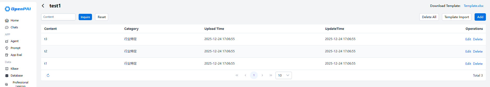

#### 2.8.6 Import and Edit Lexicon Words

Adding words to a lexicon supports two methods: page add and **.xlsx** template import.

- **Page Add**  
  Click the **Add** button in the upper right corner to add words. For blacklist lexicons, each word entry includes **content** and **type**; for whitelist lexicons, only **content** is required.

  - **Content**: supports multi-line input, with one word per line, each word limited to 20 characters, maximum 100 lines. Spaces and empty lines are filtered during import  
  - **Type**: user-configured word category  
  - Click **Import** to complete the batch import of words. After import, the words are displayed in the lexicon with pagination  

  **Note**: Duplicate words in the same lexicon are only added once. The maximum number of words that can be imported into a single lexicon is limited by the system parameter **“Maximum words per WordBase”**.

- **.xlsx Template Import**  
  - The system provides an **.xlsx** template. Users can click **Template.xlsx** to download it, which includes two columns: content and type  
  - Click **Template Import**, select the edited **.xlsx** file, and click **Open** to import the words. Empty lines and rows with empty content will be filtered, and only the first 20 characters of the content are retained  
  - After import, the words are displayed in the lexicon with pagination  

Click **Edit** to modify the word type and content. After editing, click **Import** to apply the changes.

#### 2.8.7 Lexicon Word Deletion

- **Single Word Deletion**: click the **Delete** button to the right of a word to delete it  
- **Delete All**: click the **Delete All** button in the upper right corner. A secondary confirmation dialog will pop up. Click **Yes** to delete all words in the lexicon  

### 2.9 Preferences Management

Users can set the system language, with options currently supporting Chinese and English; it also supports the display of system themes, such as light/dark mode, etc. The use of the system requires compliance with the user agreement, which can be viewed here.

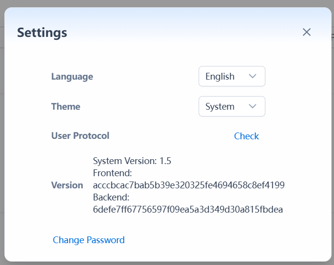

---

### 3. FAQ and Support
Resolve common issues like login problems, unavailable models, and web search errors. For technical support, contact administrators.

### 4. Version Updates
Upcoming enhancements include increased model support, a richer plugin ecosystem, and enhanced user interactions.

---

## OpenPAI: Simplifying and accelerating LLM application development!
