<a href="../README_en.md">Back</a>  

# OpenPAI User Guide

---

This user manual is intended for administrators and general users to help understand and proficiently operate various features provided by OpenPAI. This manual assumes you have successfully installed and launched OpenPAI and completed integration with OpenStation.

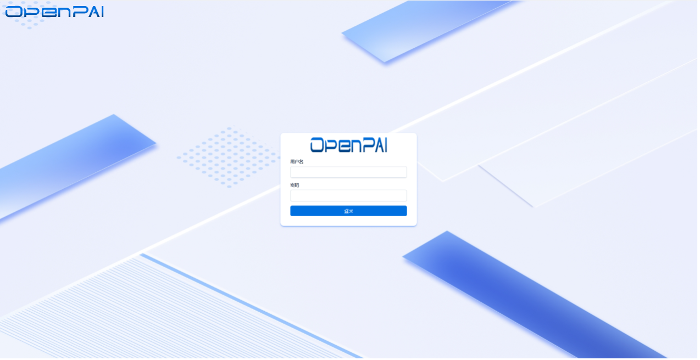

After the platform is successfully installed and deployed, enter the platform access address in the browser to open the platform login page. After entering the correct username and password, you can access the OpenPAI homepage and experience and use the various functions of OpenPAI.

## 1. Administrator Functions

Administrators have advanced management permissions, able to configure users, models, and global parameters in the "Settings" section, and experience interaction with LLMs.

### 1.1 Platform Home Page
After successful login, the **OpenPAI** homepage is displayed. Administrators can click the left or top menu to access core modules like "Chat" and "Settings."

### 1.2 Chat Functionality
On the homepage, click **"Chat"** to enter the chat window and interact with connected large models. By default, if there are no chat records, click **"New Chat."**

1. **New Chat:** Opens a new chat interface showing welcome messages, slogans, and guided questions.
2. **Select Model:** Switch models at the top of the chat window or click the settings icon to adjust parameters for this chat only.
3. **Web Search (optional):** Select "Web Search" below the input box if external internet data is needed for responses.

### 1.3 Settings
Click "Settings" at the bottom-left corner to access advanced configuration, including **"Users," "External Connections," "Models," "General," and "Account."**

#### 1.3.1 Users
OpenPAI shares a user system with OpenStation. Administrators can view users here, but adding or deleting users must be done through OpenStation.

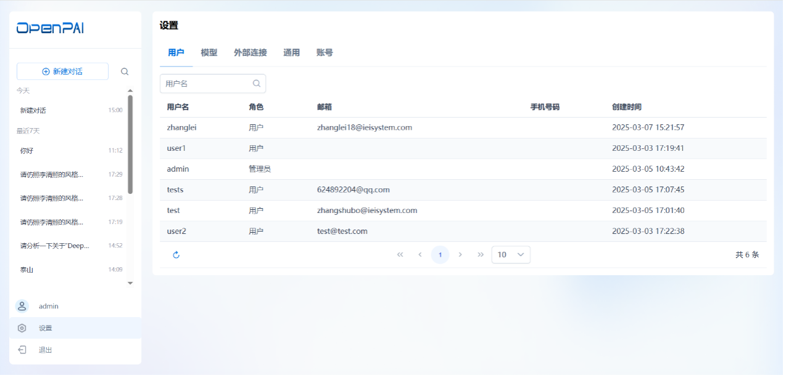

> **Note:** For creating or disabling user accounts, perform actions in OpenStation user management.

### 1.3.2 External Connections

Manage connections to various large-model providers. Initially, no models are available; administrators must connect external sources via the "Settings" page.

#### 1.3.2.1 Add External Connection
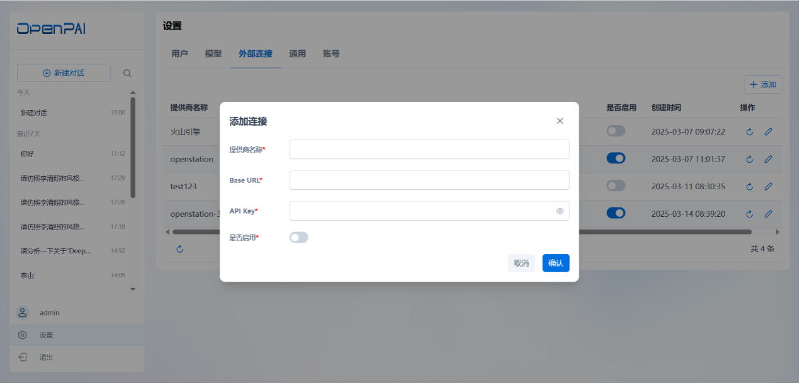

Click "Add" to enter new connection details:

- **Provider Name:** Custom name to distinguish model sources.
- **Base URL:** API URL.
- **API Key:** Access key provided by the model service.

After successfully adding, connections appear with **edit, delete, and refresh** options.

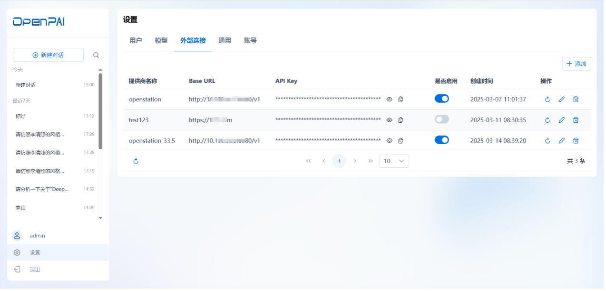

#### 1.3.2.2 Manage External Connections
- **Default Disabled:** Newly added connections must be manually enabled.
- **Refresh Connection:** Click to sync updates from providers.
- **Disable Connection:** Disables access but remains listed for future enabling.
- **Delete Connection:** Permanently removes associated models from the list.

#### 1.3.2.3 Connection Issues
If a connection fails:
- Attempt a manual refresh.
- Verify API Key and URL.
- Delete the connection if necessary.

### 1.3.3 Model Management

When administrators add a connection in the **External Connections** section, OpenPAI automatically retrieves all models from that connection and displays them in the **Model List**. The model list supports viewing detailed information such as:

- **Model Name**: Unique identifier for each model.
- **Description**: Brief introduction about the model.
- **Permissions**: Visibility of the model (Public or Private).
- **Default Model**: Indicates whether the model is selected by default for new chats.
- **Creation Time**: The time when the model was integrated into OpenPAI.

In the Model List, administrators can perform actions including **editing, setting default, disabling, and deleting models** to ensure optimal management and user experience.

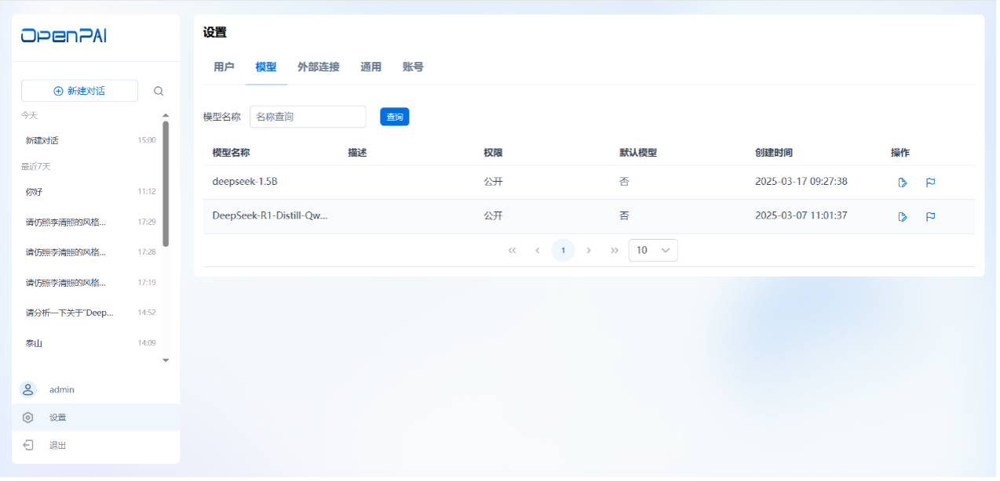

#### 1.3.3.1 Editing Models

Administrators can select a model and click the **Edit** button to modify the following parameters:

- **Model Permissions**:
  - Set as **"Public"**: Visible and usable by all users on the chat page.
  - Set as **"Private"**: Visible only to administrators, and not selectable by general users.
- **Model Parameters**:
  - Allows adjustment of default values for parameters such as temperature, maximum generation length, Top-k sampling, and Top-p filtering.
  - Changes made here take effect globally for all users.

#### 1.3.3.2 Setting Default Model

Administrators can select a model and click **"Set as Default"** to make it the default choice for new chats:

- Once set, this model is automatically selected when users create new conversations.
- If no default model is set, the most recently integrated model in the list will be selected by default.
- Only one default model can be set; selecting a new default model overrides the previous one.

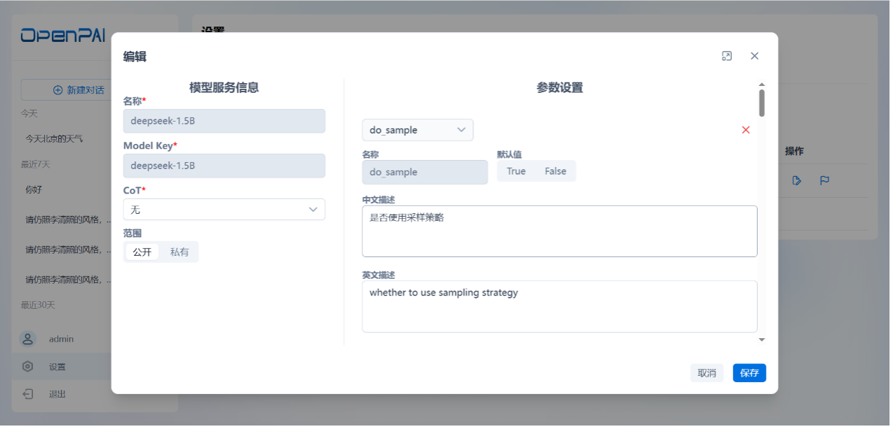

#### 1.3.3.3 Disabling or Deleting Models

- **Disable Model**:
  - Selecting a model and clicking **"Disable"** makes the model temporarily unavailable.
  - Disabled models remain in the list and can be re-enabled anytime by the administrator.

- **Delete Model**:
  - If a model is no longer needed due to business changes or API invalidation, the administrator can choose the **Delete** operation.
  - Deleted models are permanently removed from the list and cannot be restored.
  - Models can be re-added by refreshing from external connections or by creating a new external connection.

### 1.3.4 General Settings

Manage login page, chat page, web search, plugin parameters, and security reviews globally.

#### 1.3.4.1 Page Settings
Customize UI, login background, logo, and title bar for enterprise branding.

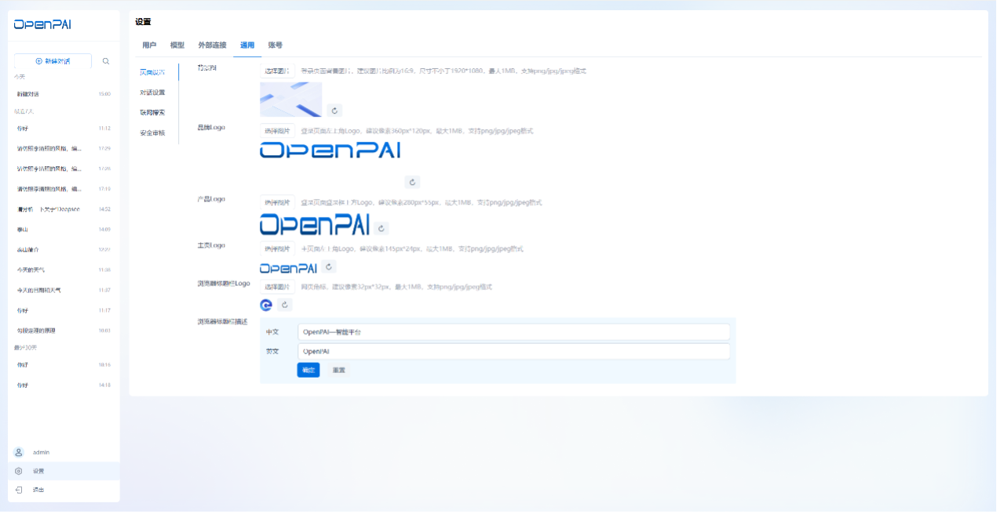

#### 1.3.4.2 Chat Settings
Customize default chat page elements: slogans, greetings, guided questions, and disclaimers.

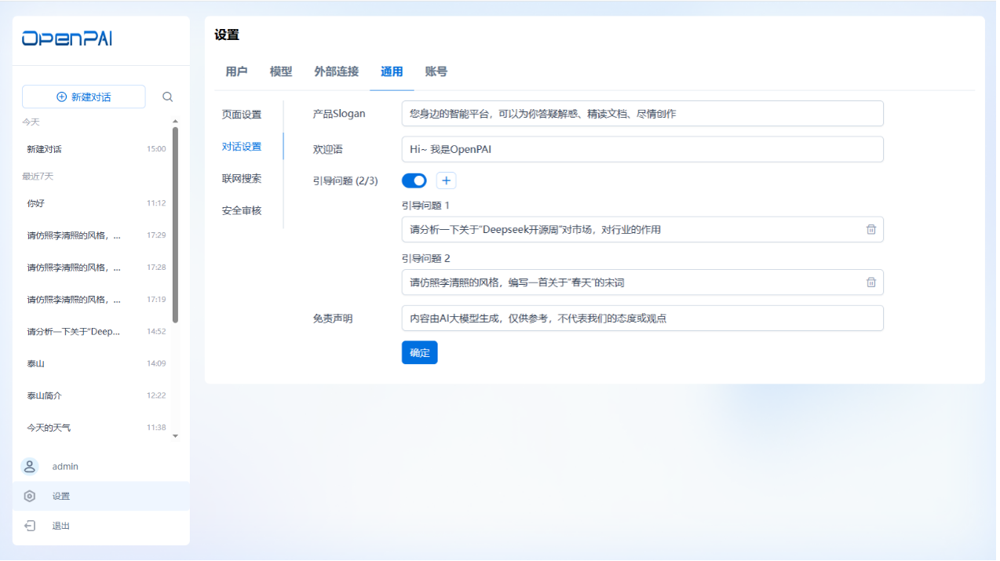

#### 1.3.4.3 Web Search
Control internet search capability during AI chats:
- Enable or disable feature
- Set search engines and API keys

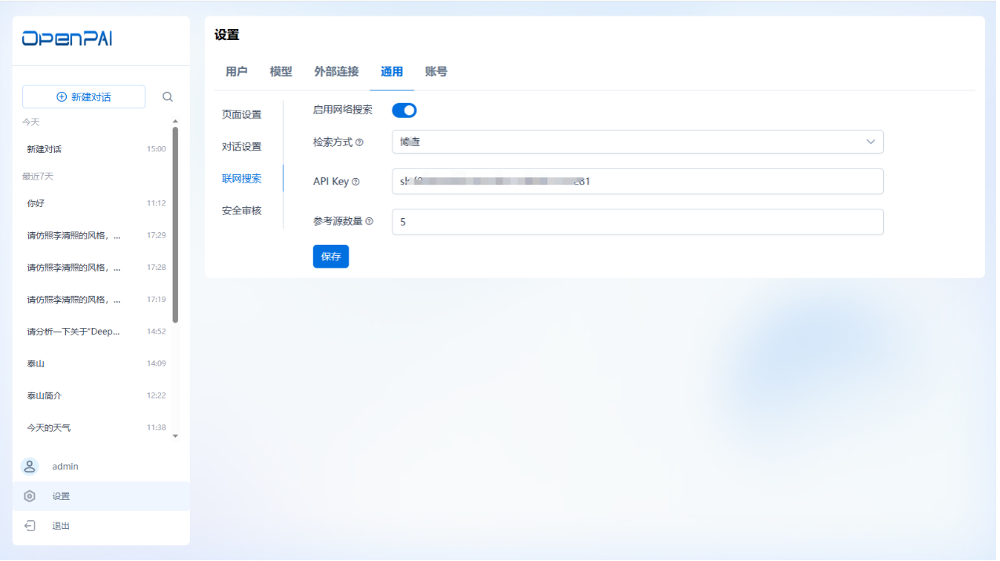

#### 1.3.4.4 Security Review
Enable content moderation and keyword monitoring for compliance.

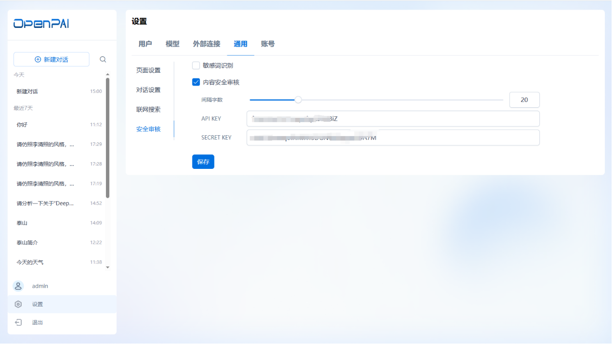

### 1.3.5 Account
View personal information and change passwords.

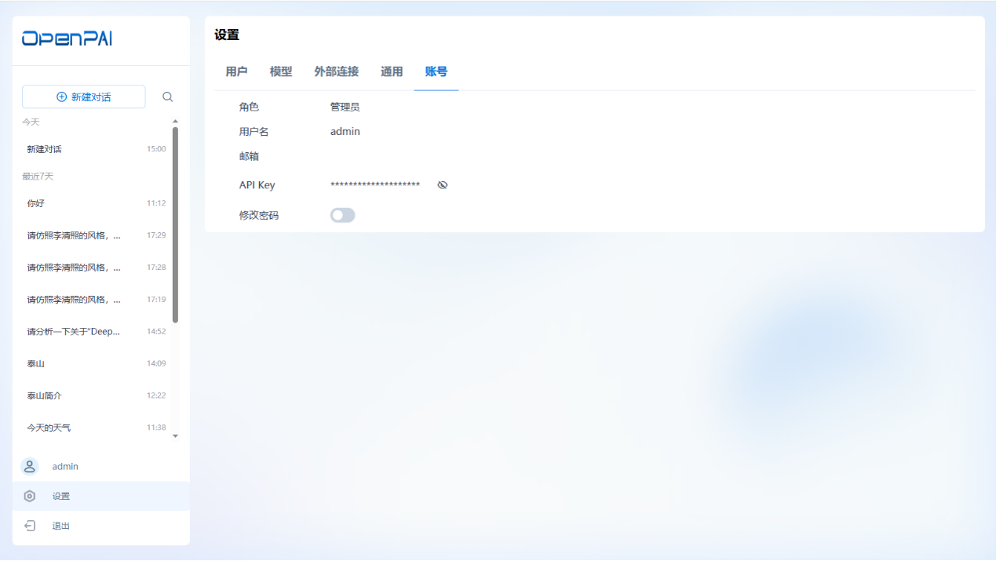

Change passwords by entering the old password followed by the new password twice.

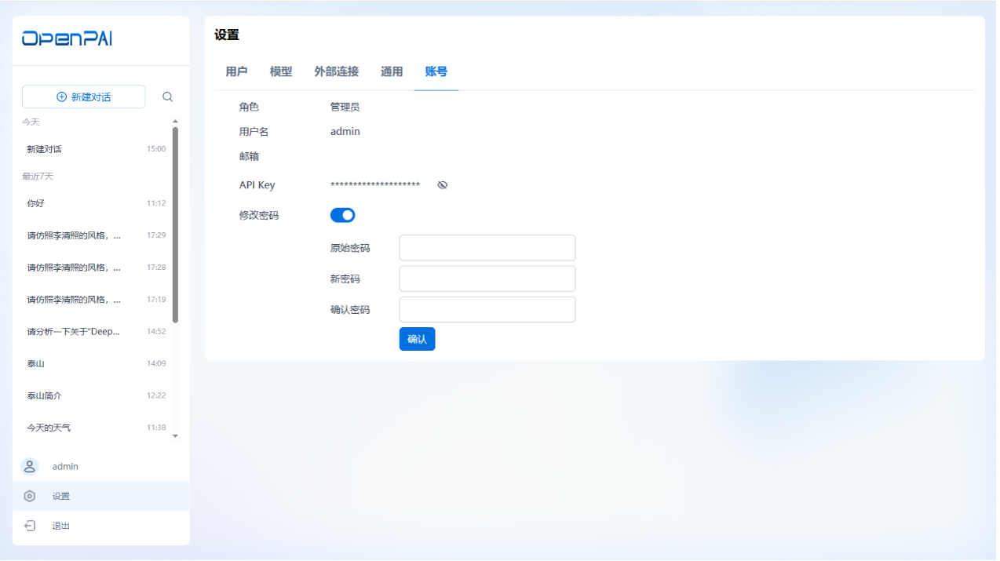

### 1.4 Chat Capabilities
Directly experience large-model interactions on the platform.

#### 1.4.1 New Chat
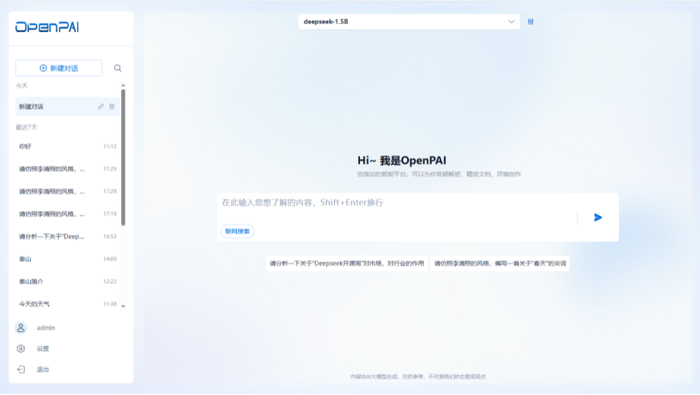

Initiate new conversations with welcome messages and guided questions.

#### 1.4.2 Adjust Model Parameters
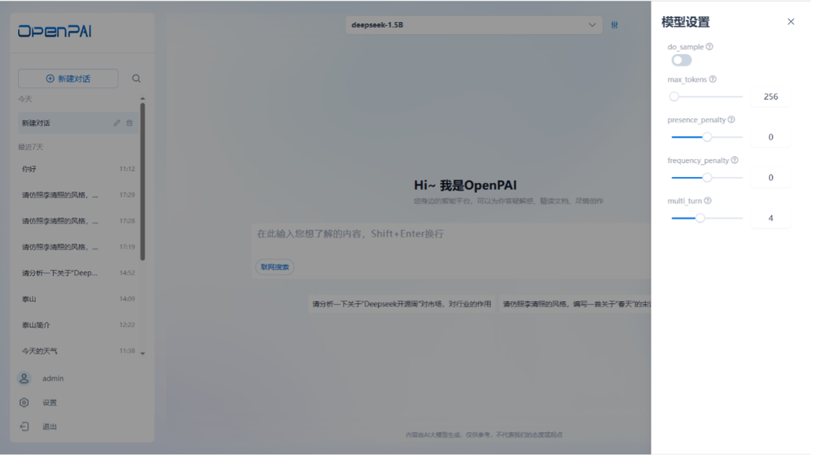

Customize parameters like Temperature and Top-k sampling, affecting only the current session.

#### 1.4.3 Web Search
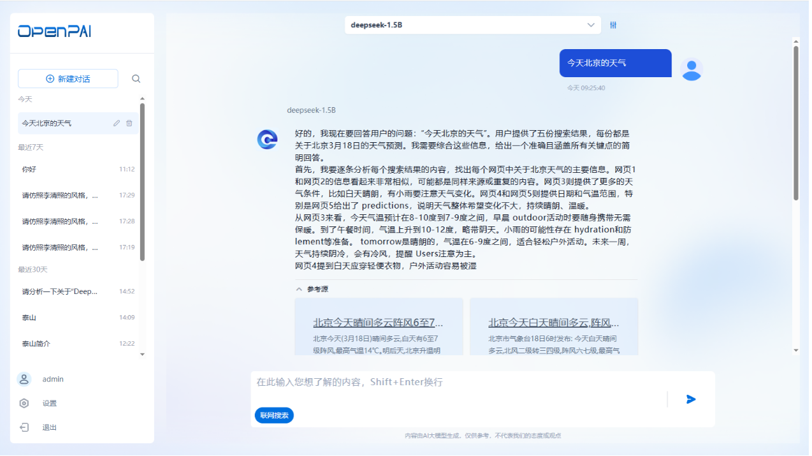

Toggle web searches for enhanced real-time responses.

---

## 2. General User Functions

General users can experience LLM interactions, adjust parameters, and use web search, while managing personal settings.

### 2.1 Chat Features

#### 2.1.1 New Chat
Open new chat windows, view greetings, and explore guided questions.

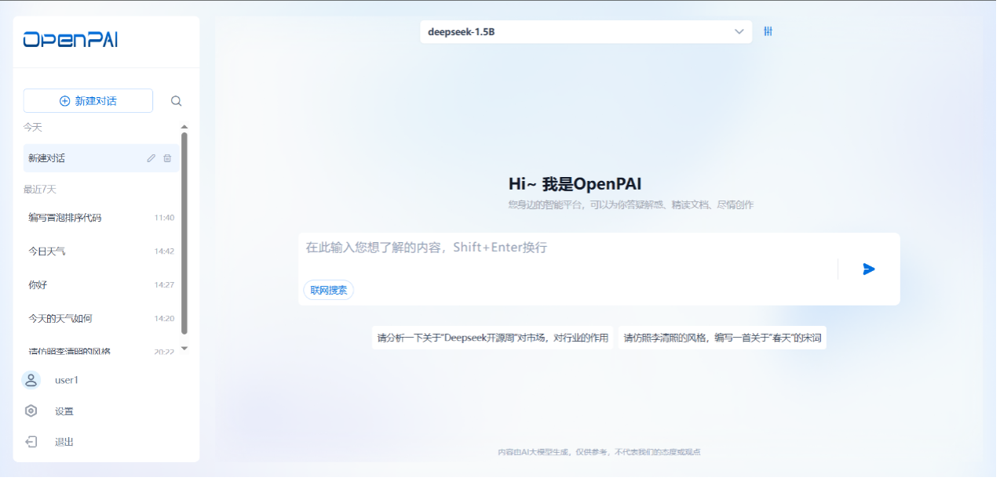

#### 2.1.2 Model Parameters
Switch and customize models, affecting current chat only.

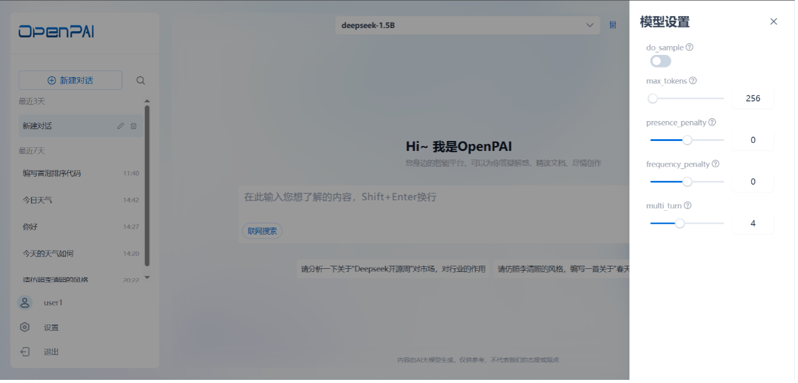

#### 2.1.3 Web Search
Choose to enable or disable internet search for real-time data.

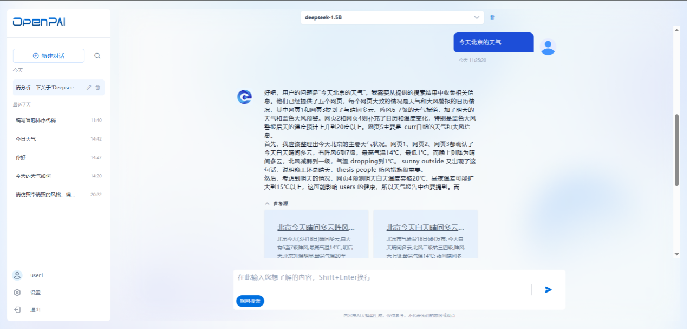

#### 2.2 Account Settings
Manage account details and password changes.

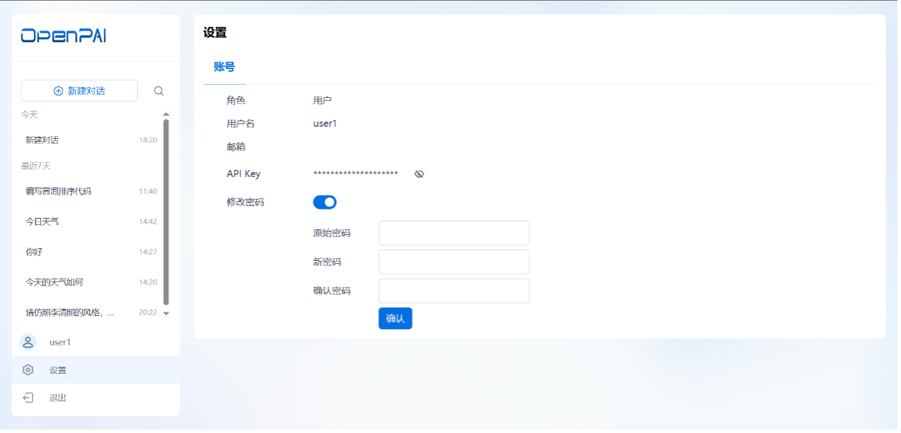

#### 2.3 Chat History (Future)
Future updates will support viewing and exporting chat histories, bookmarking, and annotating important conversations.

### 3. FAQ and Support
Resolve common issues like login problems, unavailable models, and web search errors. For technical support, contact administrators.

### 4. Version Updates
Upcoming enhancements include increased model support, a richer plugin ecosystem, and enhanced user interactions.

---

## OpenPAI: Simplifying and accelerating LLM application development!
