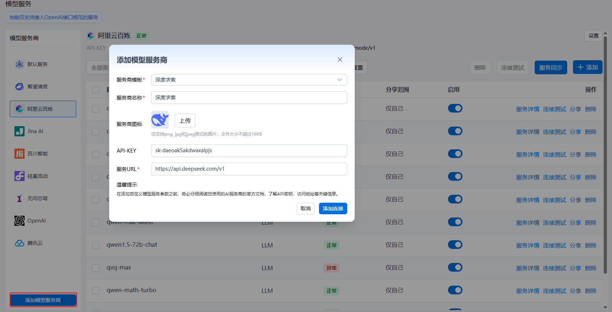
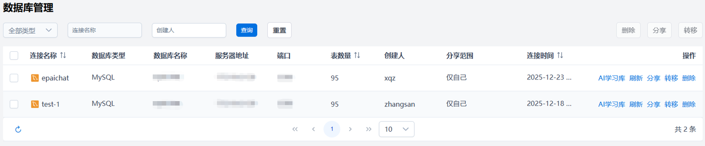
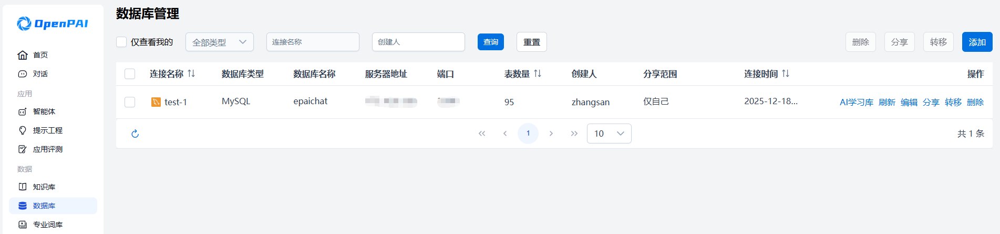
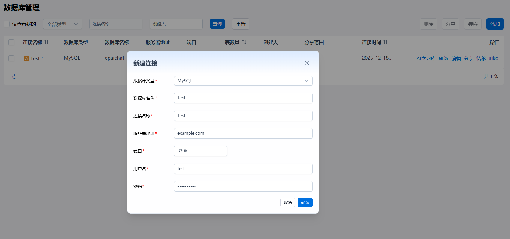
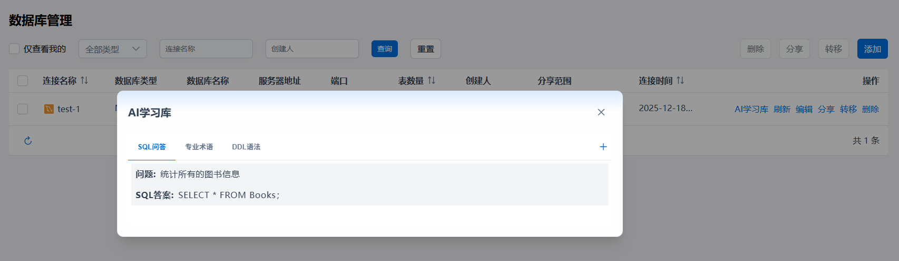

<a href="../README.md">返回</a>  

# OpenPAI 使用手册

---

本使用手册面向管理员与普通用户，帮助理解并熟练操作 OpenPAI 提供的各种功能。本手册假定你已成功安装并运行了 OpenPAI。

平台安装部署成功后，在浏览器输入平台访问地址，可打开平台的登录页。输入正确的用户名和密码后，能够访问OpenPAI的主页，体验和使用OpenPAI的各项功能。
## 1. 管理员功能

管理员（Administrator）拥有对平台的高级管理权限，可在「设置」中配置用户、模型以及全局参数，还可以管理应用、数据等。

### 1.1 平台主页
成功登录后，平台将显示 **OpenPAI** 首页，管理员可点击左侧或顶部菜单，访问「模型」、「MCP」、「应用」、「数据」、「系统」等核心模块。

### 1.2 模型服务功能
在首页可点击 **「模型服务」** 下的`模型服务`子菜单进入模型服务管理模块，

管理员可以通过“添加模型服务商”引入自己的服务商。模型添加内置多个模板，用户可以选择模板填入API-KEY进行快速添添加，也可以自行填入填入服务商名称、API-KEY以及服务URL。

如果URL能连通且支持通过OpenAI协议获取模型列表则添加时会自动将对应模型服务添加到平台，不支持则对应的模型服务列表为空。如果URL不支持获取模型列表用户可以在对应的模型服务商使用添加功能自行添加模型服务，需要填入正确的模型名称及URL。

管理员可以通过设置功能修改已经添加的模型服务商的参数，保存之后系统会重新通过URL获取模型服务列表，用户也可以通过设置-移除功能删除对应的模型服务商。服务同步功能用于获取服务商的最新的模型服务列表，如果平台保存模型服务不在服务商新的模型服务列表中则将该服务从模型服务列表中删除，如果服务商新的模型服务列表存在新的模型服务则将该模型服务添加到平台中。模型添加到平台后管理员可以通过分享功能配置模型分享范围，可以设置为全员可见或者部分用户可见，设置为部分用户可见时只有在分享范围内的用户可以使用对应模型进行对话。

### 1.3 MCP
在首页可点击 **「MCP」** 下的`MCP`子菜单，进入MCP管理模块，

### 1.4 应用
应用包括了智能体管理、审批管理、提示工程管理、应用评测任务管理等，

#### 1.4.1 智能体

在首页可点击 **「应用」** 下的`智能体`子菜单，进入智能体管理模块，

#### 1.4.2 审批管理

在首页可点击 **「应用」** 下的`审批管理`子菜单，进入审批管理模块，

#### 1.4.3 提示工程

在首页可点击 **「应用」** 下的`提示工程`子菜单，进入提示工程管理模块，

#### 1.4.4 应用评测

### 1.5 数据
数据包括了知识库、数据库、专业词库等模块，

#### 1.5.1 知识库

#### 1.5.2 数据库

管理员可以通过数据库进入数据库连接管理页面。数据库连接管理界面可以查用户创建的数据库连接的列表，数据库连接列表展示连接名称、数据库类型、数据库名称、服务器地址、端口、表数量、创建人、分享范围、连接时间。用户可以通过数据库连接类型、连接名称、创建人对数据库连接进行筛选。当用户数据库表数量变更时，管理员可以通过刷新功能更新对应数据库连接的表数量。管理员可以数据库连接给其他用户，可以指定分享全部用户或者部分用户，部分用户可以分享到指定用户或者用户组，被分享用户可以在连接列表中查看、使用该连接进行数据库对话。转移功能用于将指定数据库连接转移给其他用户，转移时目标用户列表展示所有用户。转移后该数据库连接的创建人修改为新的用户。

### 1.5.3 专业词库

### 1.6 系统
系统菜单包括了`日志管理`、`系统设置`、`用户管理`等模块，

#### 1.6.1 日志管理

#### 1.6.2 系统设置
系统设置包含了业务配置和页面配置两个tab页，业务配置主要是对系统中各个业务模块进行基础业务配置以更好的分配系统资源，合理使用系统能力。
##### 业务配置

##### 页面配置
页面配置主要是对系统进行灵活配置，以满足各个系统的个性化需求。页面配置主要是对浏览器标题栏名称、产品logo、主页logo等进行配置，可以进行修改或重置。

#### 1.6.3 用户管理

---
## 2. 普通用户功能

普通用户登录成功后，可在系统中进行智能体的概览查看、对话的交互等，也可以自行进行智能体的管理、提示工程的管理，还可以对各个应用进行评测，同时，用户还可以对各种数据进行管理，主要是知识库、数据库、专业词库的管理。对于系统的使用，用户可以进行系统设置，以满足自身偏好需求。

### 2.1 首页

### 2.2 对话功能

 **「对话」** 页面，体验大模型交互能力。用户可以 **创建对话、调整模型参数、使用联网搜索**，并在 **「设置」** 页面管理个人信息。

#### 2.1.1 新建对话

点击 **「新建对话」**，系统将打开一个全新的对话窗口。用户可以：
- 查看 **欢迎语**，快速进入对话模式。
- 浏览 **产品 Slogan**，了解 OpenPAI 的核心特点。
- 参考 **引导问题**，帮助用户体验 AI 交互能力。

### 2.3 智能体管理

### 2.4 提示工程管理

### 2.5 应用评测

### 2.6 知识库管理

### 2.7 数据库管理

数据库连接管理界面可以查看自己创建或者他人分享数据库连接的列表，数据库连接列表展示连接名称、数据库类型、数据库名称、服务器地址、端口、创建人、分享范围、连接时间。用户可以通过数据库仅查看我的、连接类型、连接名称、创建人对数据库连接进行筛选。

用户可以通过创建数据库连接功能添加数据库连接，用户需要选择数据库类型（支持的数据库类型MySQL、PostgreSQL、MariaDB、SQL Server、Oracle、Dameng），填入连接名称、服务器地址、端口、用户名、密码、数据库名称。确认后系统会使用数据库类型、服务器地址、端口、用户名、密码、数据库名称进行连接测试，如果数据库连接失败则创建失败，连接成功则创建成功，创建后平台会自动读取数据库的表信息。刷新列表可以查看新创建的数据库连接。

当用户数据库表数量变更时，用户可以通过刷新功能更新对应数据库连接的表数量。数据库创建者可以数据库连接给其他用户，可以指定分享全部用户或者部分用户，部分用户可以分享到指定用户或者用户组，被分享用户可以在连接列表中查看、使用该连接进行数据库对话。转移功能用于将指定数据库连接转移给其他用户，转移时目标用户列表展示所有用户。转移后该数据库连接的创建人修改为新的用户。

AI学习库信息AI学习库中的数据用于对话时给大模型提供提示词，可以提高大模型答复的准确率。用户可以查看该数据库对应的学习库数据，并可以通过添加功能将添加自己的学习数据。AI学习库数据包括三种类型：SQL问答、专业术语、DDL语法。SQL问答包括问题描述及该问题对应的SQL答案；专业术语为描述该数据库信息的描述语言可以填入数据库结构、用途等相关信息；DDL语法为数据库中数据表创建或修改的SQL语句，在数据库添加时系统会读取数据库中表的创建语句并添加到学习库中，用户可以对此部分数据进行修改、删除或添加。

### 2.8 专业词库管理

### 2.9 偏好设置

用户可以进行系统语言的设置，可选项目前支持中文和英文；同时还支持系统主题的展示，比如明亮/暗黑模式等；系统使用需要满足用户协议，可以从此处查看。

---

## 3. 常见问题与支持

1. **无法登录**：请先确认已在系统中创建账号，并输入正确的用户名和密码。
2. **没有可用模型**：可能尚未配置模型，或模型被设为「私有」。请联系管理员。

如有更多技术问题，请联系运维团队或管理员。

---

## 4. 版本迭代与更新

未来版本中，我们将持续优化：
- **更多模型支持**：与更多公有云或企业自研模型连接。
- **插件生态**：进一步完善知识库、文档管理、自动化工作流等功能。
- **用户体验**：加强对话体验，提供多轮上下文管理、多语言支持。

 

---

## OpenPAI，让大模型应用开发更轻松、更高效！
