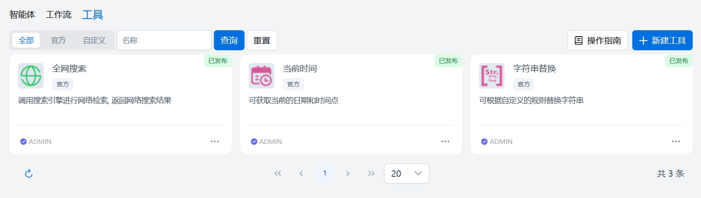

<a href="../README.md">返回</a>  

# OpenPAI 使用手册

---

本使用手册面向管理员与普通用户，帮助理解并熟练操作 OpenPAI 提供的各种功能。本手册假定你已成功安装并运行了 OpenPAI。

平台安装部署成功后，在浏览器输入平台访问地址，可打开平台的登录页。输入正确的用户名和密码后，能够访问OpenPAI的主页，体验和使用OpenPAI的各项功能。
## 1. 管理员功能

管理员（Administrator）拥有对平台的高级管理权限，可在「设置」中配置用户、模型以及全局参数，还可以管理应用、数据等。

### 1.1 平台主页
成功登录后，平台将显示 **OpenPAI** 首页，管理员可点击左侧或顶部菜单，访问「模型」、「MCP」、「应用」、「数据」、「系统」等核心模块。

### 1.2 模型服务功能
在首页可点击 **「模型服务」** 下的`模型服务`子菜单进入模型服务管理模块，

管理员可以通过“添加模型服务商”引入自己的服务商。模型添加内置多个模板，用户可以选择模板填入API-KEY进行快速添添加，也可以自行填入填入服务商名称、API-KEY以及服务URL。

如果URL能连通且支持通过OpenAI协议获取模型列表则添加时会自动将对应模型服务添加到平台，不支持则对应的模型服务列表为空。如果URL不支持获取模型列表用户可以在对应的模型服务商使用添加功能自行添加模型服务，需要填入正确的模型名称及URL。

管理员可以通过设置功能修改已经添加的模型服务商的参数，保存之后系统会重新通过URL获取模型服务列表，用户也可以通过设置-移除功能删除对应的模型服务商。服务同步功能用于获取服务商的最新的模型服务列表，如果平台保存模型服务不在服务商新的模型服务列表中则将该服务从模型服务列表中删除，如果服务商新的模型服务列表存在新的模型服务则将该模型服务添加到平台中。模型添加到平台后管理员可以通过分享功能配置模型分享范围，可以设置为全员可见或者部分用户可见，设置为部分用户可见时只有在分享范围内的用户可以使用对应模型进行对话。

### 1.3 MCP
在首页可点击 **「MCP」** 下的`MCP`子菜单，进入MCP管理模块，

### 1.4 应用
应用包括了智能体管理、审批管理、提示工程管理、应用评测任务管理等，

#### 1.4.1 智能体

在首页可点击 **「应用」** 下的`智能体`子菜单，进入智能体管理模块，

#### 1.4.2 审批管理

在首页可点击 **「应用」** 下的`审批管理`子菜单，进入审批管理模块，

#### 1.4.3 提示工程

在首页可点击 **「应用」** 下的`提示工程`子菜单，进入提示工程管理模块，

#### 1.4.4 应用评测

### 1.5 数据
数据包括了知识库、数据库、专业词库等模块，

#### 1.5.1 知识库

#### 1.5.2 数据库

管理员可以通过数据库进入数据库连接管理页面。数据库连接管理界面可以查用户创建的数据库连接的列表，数据库连接列表展示连接名称、数据库类型、数据库名称、服务器地址、端口、表数量、创建人、分享范围、连接时间。用户可以通过数据库连接类型、连接名称、创建人对数据库连接进行筛选。当用户数据库表数量变更时，管理员可以通过刷新功能更新对应数据库连接的表数量。管理员可以数据库连接给其他用户，可以指定分享全部用户或者部分用户，部分用户可以分享到指定用户或者用户组，被分享用户可以在连接列表中查看、使用该连接进行数据库对话。转移功能用于将指定数据库连接转移给其他用户，转移时目标用户列表展示所有用户。转移后该数据库连接的创建人修改为新的用户。

### 1.5.3 专业词库

### 1.6 系统
系统菜单包括了`日志管理`、`系统设置`、`用户管理`等模块，

#### 1.6.1 日志管理

管理员登录后，点击页面左侧的“日志管理”进入该模块。日志列表中显示的信息包括：操作人、操作模块、操作对象、操作类型、操作结果、操作反馈信息、操作时间以及操作详情，其中操作详情包含操作前和操作后的数据。管理员可以根据操作模块、操作类型、操作结果、开始时间、结束时间、操作人等信息进行联合查询，也可以点击“重置”显示默认结果。此外，管理员可以分别对以下模块进行排序：操作模块、操作类型、操作结果以及操作时间。管理员可以根据查询的条件对查询结果进行导出，最多导出1000条数据，导出的数据为.csv格式的文件。

#### 1.6.2 系统设置
系统设置包含了业务配置和页面配置两个tab页，业务配置主要是对系统中各个业务模块进行基础业务配置以更好的分配系统资源，合理使用系统能力。
##### 业务配置

##### 页面配置
页面配置主要是对系统进行灵活配置，以满足各个系统的个性化需求。页面配置主要是对浏览器标题栏名称、产品logo、主页logo等进行配置，可以进行修改或重置。

#### 1.6.3 用户管理

---
## 2. 普通用户功能

普通用户登录成功后，可在系统中进行智能体的概览查看、对话的交互等，也可以自行进行智能体的管理、提示工程的管理，还可以对各个应用进行评测，同时，用户还可以对各种数据进行管理，主要是知识库、数据库、专业词库的管理。对于系统的使用，用户可以进行系统设置，以满足自身偏好需求。

### 2.1 首页

### 2.2 对话功能

 **「对话」** 页面，体验大模型、智能体、数据库交互。用户可以选择与大模型对话、与智能体对话、与数据库对话，并管理对话信息。

#### 2.1.1 新建对话

点击 **「新建对话」**，系统将打开一个全新的对话窗口。用户可以：
- 快速进入对话模式

打开新建对话的页面，用户可以看到要交互的对象，比如模型、智能体或者是某个数据库，如果不存在智能体，可以在「智能体」模块下创建智能体；如果未选择数据库或者未创建数据库，可以预先在「数据库」模块下创建数据库信息。

- 浏览交互对象的基本信息

对于不同的交互对象，显示不同的信息，如果与大模型进行对话则显示的是模型信息，并可以对模型参数进行修改；如果与智能体进行对话，则显示智能体信息；类似的数据库对话，显示数据库连接信息，供用户选择。

- 多样化对话交互，获取问答结果

用户可以发送问题，并等待系统回复，回复内容以流式输出。系统支持上传多种格式的文件、音频、图片，并针对其进行问答交互。

- 设置交互细节，获取精准、定制化交互

用户可以更改模型参数、选择工具（内容安全审核、全网搜索、知识库问答等）进行更细致精确的回复。

#### 2.1.2 管理对话

- 对话的增删改查，系统支持对话查询、更改名称、删除对话等操作
- 复制对话，对于某个对话，可以复制一个新的对话，包含当前对话的所有配置信息，而不含交互历史
- 导出对话记录，对于对话交互历史，可以导出为markdown格式的文件到本地

#### 2.1.3 管理对话内容

- 复制内容：用户可以快捷复制问题或答案
- 引用内容：可以引用之前的内容并做继续问答
- 重新生成对话，用户可以对某个对话进行内容重新生成
- 删除问答对：用户可以将多个问答对进行删除，不再展示
- 收藏：收藏问答对到知识库模块
- 用户评价回答质量：支持用户对回答结果做评价，点赞或点踩

### 2.3 智能体管理

#### 2.3.1 智能体
- 智能体查询，展示信息包括：图标、名称、仅自己/部分用户/全员、状态、标签、描述信息、创建者名称、创建时间；
- 智能体创建，可以创建空白智能体和基于模板进行创建；
- 智能体编辑，可以修改名称、图标、标签、描述信息；
- 智能体复制，基于已有的智能体进行复制；
- 智能体删除，删除已有智能体；
- 智能体配置，智能体支持两种配置方式：通用模式和工作流模式，
  - 通用模式的配置信息包括：模型（选择模型并配置相应的模型参数）；Prompt（输入智能体的提示词；提示词可以从内置的提示词库中获取，选中；MCP服务（选择智能体可调用的MCP服务）；工具（选择智能体可调用的工具，并配置相应的工具参数，目前支持官方工具和自定义工具）；知识库（选择智能体可调用的知识库，并配置相应参数，知识库支持选择多个）；数据库（选择智能体可调用的数据库，并配置相应参数）； 开场白及开场白引导问题（打开开关后，用户可以为该智能体设置开场白，以及自己关注的几个引导问题。引导问题最多设置3个，每个引导问题最多支持100字符长度）；推荐问题（打开开关后，智能体会在对话后输出最多3个推荐问题）；
  - 工作流模式的智能体配置信息包括：工作流（只支持添加一个工作流）； 开场白及开场白引导问题（打开开关后，用户可以为该智能体设置开场白，以及自己关注的几个引导问题。引导问题最多设置3个）；推荐问题（打开开关后，智能体会在对话后输出最多3个推荐问题）；
- 智能体预览与调试，基于已有配置进行智能体对话效果查看；工具调用会展示工具调用状态和耗时；
- 智能体发布，将已经调试好的智能体发布成可调用的服务，发布后会进入审批流程。发布支持域名方式和IP端口号方式，域名方式需要填写API地址名称，以及资源配置（CPU、内存和副本数）；IP端口号方式地址自动生成，资源配置（CPU、内存和副本数）可以手动修改；已发布的智能体，在详情页面会有”API调用“按钮，点击该按钮查看调用信息，点击“创建API KEY“按钮，可以对用户访问凭证进行管理，包括创建、编辑、禁用和删除等操作。
- 智能体API文档，已发布的智能体，在详情页面可以查看该智能体的API文档；
- 智能体分享，用户可以对创建的已发布的智能体进行分享的操作。分享范围默认为仅自己，可以选择部分用户和全员，当选择部分用户时，可以点击“添加”按钮在弹出的界面中添加用户和用户组，添加完成后会在分享界面显示，然后点击“确认”完成分享;
- 智能体对话，已发布的智能体可以直接开启对话，跳转到对话模块的智能体对话；
- 智能体发布渠道，智能体发布审批通过之后，用户可以设置UI访问方式是否需要免密、网页嵌入方式、企业微信的配置和钉钉机器人的配置；
- 智能体日志，智能体发布审批通过之后，会看到日志，展示更新时间、用户、调用方式、消息数、内容标题、创建时间；调用方式包括UI访问、智能体对话、API访问、企业微信、钉钉机器人；
- 智能体数据，智能体发布审批通过之后，会看到数据，展示信息包括：总用户数、总调用量、总token数、平均响应时长；以及图像化的曲线展示；
- 多模对比，进入多模对比调试页面，用户可以选择不同的模型和不同的提示词来查看智能体效果；用户选择较好效果的模型和提示词可以退出对比模式；
- 智能体对话历史，用户在调试页面可以看到之前的对话历史，展示用户的问题和回复；对话历史可以清空；

#### 2.3.2 工作流
- 工作流查询，工作流的展示信息包括：图标、名称、已发布/未发布、描述信息、创建者名称、创建时间；用户可以根据状态、名称进行过滤查询，状态可选已发布和未发布两种状态，名称支持模糊匹配；
- 工作流新建，可以创建空白工作流和基于模板进行创建；可以填写名称、图标、描述信息；
- 工作流编辑，可以修改名称、图标、描述信息；
- 工作流复制，基于已有的工作流进行复制；
- 工作流删除，删除已有工作流；
- 工作流详情，从列表中选择一个工作流，点击，进入工作流详情,支持的节点类型包括：基础节点：大模型、知识库、数据库、结束；逻辑节点：问题分类器、条件分支、结果合并、迭代；组件节点：MCP、记忆节点、变量赋值、变量聚合、Http请求、JSON处理、参数提取、文档提取器、安全审核；工具节点：全网搜索、当前时间、字符串替换、自定义工具；
- 工作流调试，工作流画布中的节点可以进行单步调试，以便及早的发现问题；工作流的整体调试；用户在对话框输入问题；等待工作流回答，最终会将回答的信息在对话框进行展示；在对话框中可以看到每个节点的执行状态，执行时间以及每个节点执行的详细信息
- 工作流发布，将已经调试好的工作流发布成可调用的服务，工作流发布后不需要审批，直接在工作流列表页面变为已发布状态。用户可以继续修改工作流之后进行多次发布；
- 工作流对话历史，用户在调试页面可以看到之前的对话历史，展示用户的问题和回复；对话历史可以清空；

#### 2.3.3 工具

工具界面展示当前用户在智能体或工作流中可以使用的工具汇总。

用户可以：

- 新增工具（以**API**的形式接入）
- 删除工具
- 编辑工具

### 2.4 提示工程管理

### 2.5 应用评测

### 2.6 知识库管理

### 2.7 数据库管理

数据库连接管理界面可以查看自己创建或者他人分享数据库连接的列表，数据库连接列表展示连接名称、数据库类型、数据库名称、服务器地址、端口、创建人、分享范围、连接时间。用户可以通过数据库仅查看我的、连接类型、连接名称、创建人对数据库连接进行筛选。

用户可以通过创建数据库连接功能添加数据库连接，用户需要选择数据库类型（支持的数据库类型MySQL、PostgreSQL、MariaDB、SQL Server、Oracle、Dameng），填入连接名称、服务器地址、端口、用户名、密码、数据库名称。确认后系统会使用数据库类型、服务器地址、端口、用户名、密码、数据库名称进行连接测试，如果数据库连接失败则创建失败，连接成功则创建成功，创建后平台会自动读取数据库的表信息。刷新列表可以查看新创建的数据库连接。

当用户数据库表数量变更时，用户可以通过刷新功能更新对应数据库连接的表数量。数据库创建者可以数据库连接给其他用户，可以指定分享全部用户或者部分用户，部分用户可以分享到指定用户或者用户组，被分享用户可以在连接列表中查看、使用该连接进行数据库对话。转移功能用于将指定数据库连接转移给其他用户，转移时目标用户列表展示所有用户。转移后该数据库连接的创建人修改为新的用户。

AI学习库信息AI学习库中的数据用于对话时给大模型提供提示词，可以提高大模型答复的准确率。用户可以查看该数据库对应的学习库数据，并可以通过添加功能将添加自己的学习数据。AI学习库数据包括三种类型：SQL问答、专业术语、DDL语法。SQL问答包括问题描述及该问题对应的SQL答案；专业术语为描述该数据库信息的描述语言可以填入数据库结构、用途等相关信息；DDL语法为数据库中数据表创建或修改的SQL语句，在数据库添加时系统会读取数据库中表的创建语句并添加到学习库中，用户可以对此部分数据进行删除或添加。

### 2.8 专业词库管理

### 2.9 偏好设置

用户可以进行系统语言的设置，可选项目前支持中文和英文；同时还支持系统主题的展示，比如明亮/暗黑模式等；系统使用需要满足用户协议，可以从此处查看。

---

## 3. 常见问题与支持

1. **无法登录**：请先确认已在系统中创建账号，并输入正确的用户名和密码。
2. **没有可用模型**：可能尚未配置模型，或模型被设为「私有」。请联系管理员。

如有更多技术问题，请联系运维团队或管理员。

---

## 4. 版本迭代与更新

未来版本中，我们将持续优化：
- **更多模型支持**：与更多公有云或企业自研模型连接。
- **插件生态**：进一步完善知识库、文档管理、自动化工作流等功能。
- **用户体验**：加强对话体验，提供多轮上下文管理、多语言支持。

 

---

## OpenPAI，让大模型应用开发更轻松、更高效！
