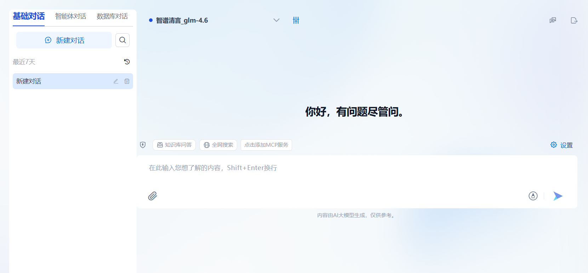
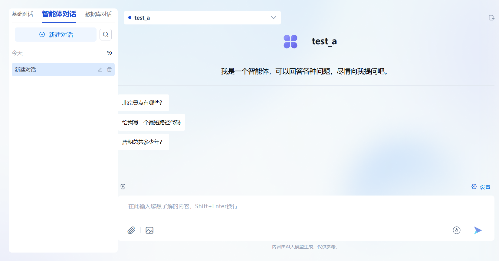
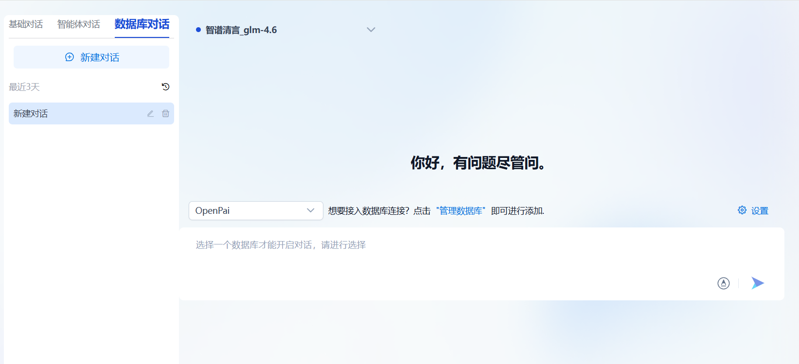
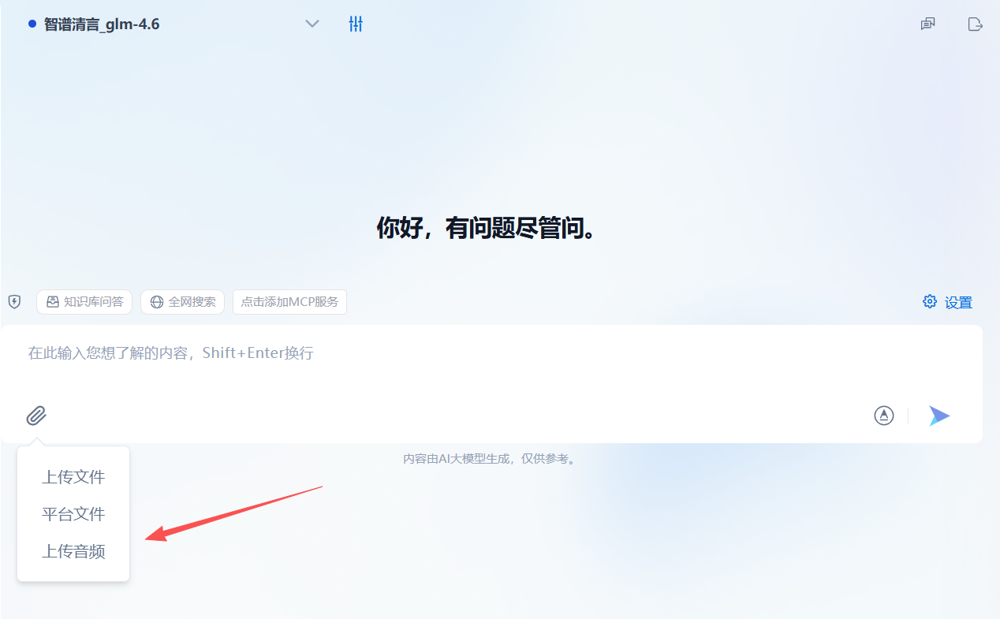
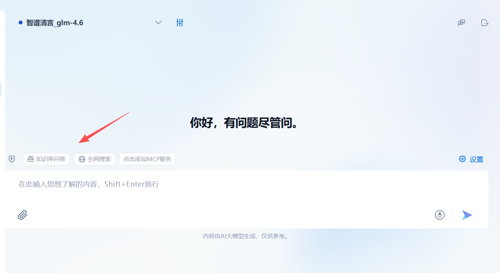
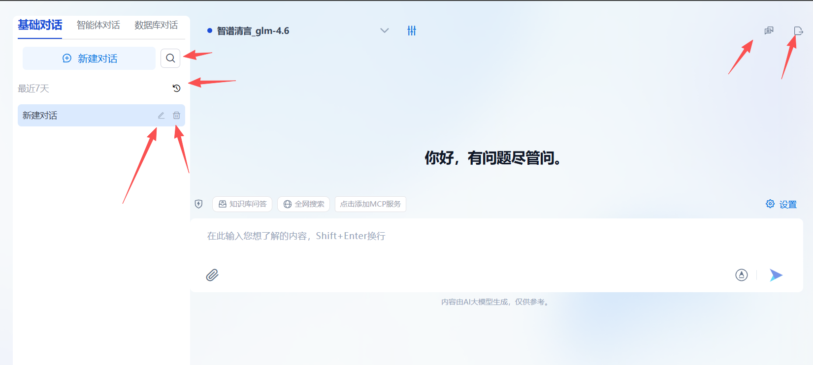
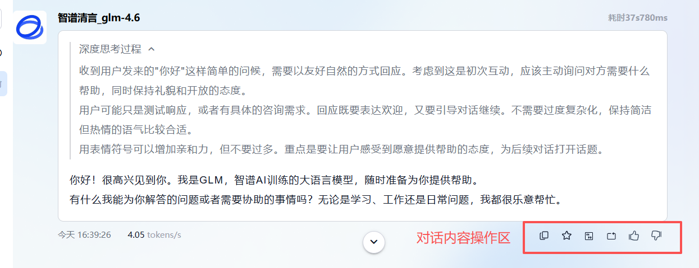

<a href="../README.md">返回</a>  

# OpenPAI 使用手册

---

本使用手册面向管理员与普通用户，帮助理解并熟练操作 OpenPAI 提供的各种功能。本手册假定你已成功安装并运行了 OpenPAI。

平台安装部署成功后，在浏览器输入平台访问地址，可打开平台的登录页。输入正确的用户名和密码后，能够访问OpenPAI的主页，体验和使用OpenPAI的各项功能。
## 1. 管理员功能

管理员（Administrator）拥有对平台的高级管理权限，可在「设置」中配置用户、模型以及全局参数，还可以管理应用、数据等。

### 1.1 平台主页
成功登录后，平台将显示 **OpenPAI** 首页，管理员可点击左侧或顶部菜单，访问「模型」、「MCP」、「应用」、「数据」、「系统」等核心模块。

### 1.2 模型功能
在首页可点击 **「模型」** 下的`模型服务`子菜单进入模型服务管理模块，

#### 1.2.1 模型服务商
#### 1.2.2 模型服务

### 1.3 MCP
在首页可点击 **「MCP」** 下的`MCP`子菜单，进入MCP管理模块，

### 1.4 应用
应用包括了智能体管理、审批管理、提示工程管理、应用评测任务管理等，

#### 1.4.1 智能体

在首页可点击 **「应用」** 下的`智能体`子菜单，进入智能体管理模块，

#### 1.4.2 审批管理

在首页可点击 **「应用」** 下的`审批管理`子菜单，进入审批管理模块，

#### 1.4.3 提示工程

在首页可点击 **「应用」** 下的`提示工程`子菜单，进入提示工程管理模块，

#### 1.4.4 应用评测

### 1.5 数据
数据包括了知识库、数据库、专业词库等模块，

#### 1.5.1 知识库

#### 1.5.2 数据库

### 1.5.3 专业词库

### 1.6 系统
系统菜单包括了`日志管理`、`系统设置`、`用户管理`等模块，

#### 1.6.1 日志管理

#### 1.6.2 系统设置
系统设置包含了业务配置和页面配置两个tab页，业务配置主要是对系统中各个业务模块进行基础业务配置以更好的分配系统资源，合理使用系统能力。
##### 业务配置

##### 页面配置
页面配置主要是对系统进行灵活配置，以满足各个系统的个性化需求。页面配置主要是对浏览器标题栏名称、产品logo、主页logo等进行配置，可以进行修改或重置。

#### 1.6.3 用户管理

---
## 2. 普通用户功能

普通用户登录成功后，可在系统中进行智能体的概览查看、对话的交互等，也可以自行进行智能体的管理、提示工程的管理，还可以对各个应用进行评测，同时，用户还可以对各种数据进行管理，主要是知识库、数据库、专业词库的管理。对于系统的使用，用户可以进行系统设置，以满足自身偏好需求。

### 2.1 首页

### 2.2 对话功能

 **「对话」** 页面，体验大模型、智能体、数据库交互。用户可以选择与大模型对话、与智能体对话、与数据库对话，并管理对话信息。

#### 2.1.1 新建对话

点击 **「新建对话」**，系统将打开一个全新的对话窗口。用户可以：
- 快速进入对话模式

打开新建对话的页面，用户可以看到要交互的对象，比如模型、智能体或者是某个数据库，如果不存在智能体，可以在「智能体」模块下创建智能体；如果未选择数据库或者未创建数据库，可以预先在「数据库」模块下创建数据库信息。

- 浏览交互对象的基本信息

对于不同的交互对象，显示不同的信息，如果与大模型进行对话则显示的是模型信息，并可以对模型参数进行修改；如果与智能体进行对话，则显示智能体信息；类似的数据库对话，显示数据库连接信息，供用户选择。

- 多样化对话交互，获取问答结果

用户可以发送问题，并等待系统回复，回复内容以流式输出。系统支持上传多种格式的文件、音频、图片，并针对其进行问答交互。

- 设置交互细节，获取精准、定制化交互

用户可以更改模型参数、选择工具（内容安全审核、全网搜索、知识库问答等）进行更细致精确的回复。

#### 2.1.2 管理对话

- 对话的增删改查，系统支持对话查询、更改名称、删除对话等操作
- 复制对话，对于某个对话，可以复制一个新的对话，包含当前对话的所有配置信息，而不含交互历史
- 导出对话记录，对于对话交互历史，可以导出为markdown格式的文件到本地

#### 2.1.3 管理对话内容

- 复制内容：用户可以快捷复制问题或答案
- 引用内容：可以引用之前的内容并做继续问答
- 重新生成对话，用户可以对某个对话进行内容重新生成
- 删除问答对：用户可以将多个问答对进行删除，不再展示
- 收藏：收藏问答对到知识库模块
- 用户评价回答质量：支持用户对回答结果做评价，点赞或点踩

### 2.3 智能体管理

### 2.4 提示工程管理

### 2.5 应用评测

### 2.6 知识库管理

### 2.7 数据库管理

### 2.8 专业词库管理

### 2.9 偏好设置

用户可以进行系统语言的设置，可选项目前支持中文和英文；同时还支持系统主题的展示，比如明亮/暗黑模式等；系统使用需要满足用户协议，可以从此处查看。

---

## 3. 常见问题与支持

1. **无法登录**：请先确认已在系统中创建账号，并输入正确的用户名和密码。
2. **没有可用模型**：可能尚未配置模型，或模型被设为「私有」。请联系管理员。

如有更多技术问题，请联系运维团队或管理员。

---

## 4. 版本迭代与更新

未来版本中，我们将持续优化：
- **更多模型支持**：与更多公有云或企业自研模型连接。
- **插件生态**：进一步完善知识库、文档管理、自动化工作流等功能。
- **用户体验**：加强对话体验，提供多轮上下文管理、多语言支持。

 

---

## OpenPAI，让大模型应用开发更轻松、更高效！
