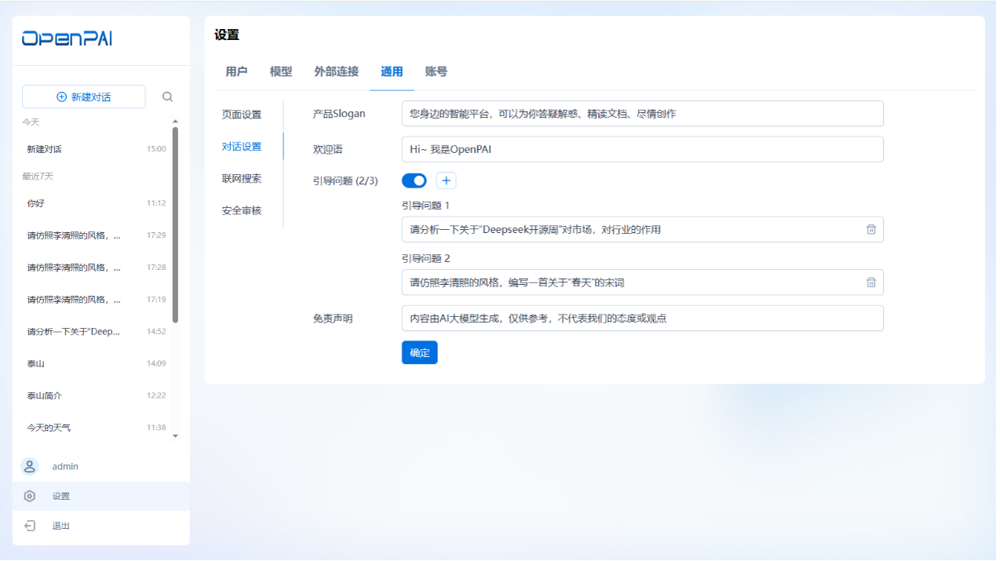
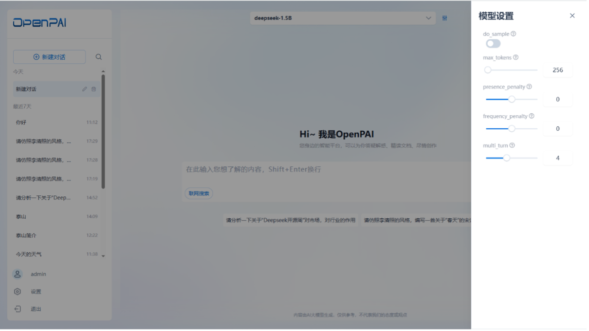
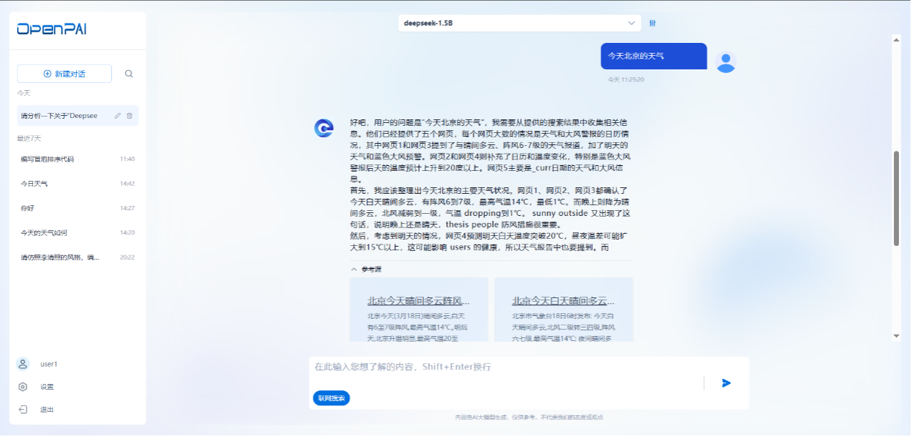

<a href="../README.md">返回</a>  

# OpenPAI 使用手册

---

本使用手册面向管理员与普通用户，帮助理解并熟练操作 OpenPAI 提供的各种功能。本手册假定你已成功安装并运行了 OpenPAI，并完成了与 OpenStation 的集成。

平台安装部署成功后，在浏览器输入平台访问地址，可打开平台的登录页。输入正确的用户名和密码后，能够访问OpenPAI的主页，体验和使用OpenPAI的各项功能。
## 1. 管理员功能

管理员（Administrator）拥有对平台的高级管理权限，可在「设置」中配置用户、模型以及全局参数，并可体验与 LLM 进行对话。

### 1.1 平台主页
成功登录后，平台将显示 **OpenPAI** 首页，管理员可点击左侧或顶部菜单，访问「对话」、「设置」等核心模块。

### 1.2 对话功能
在首页可点击 **「对话」** 进入聊天窗口，与已接入的任何大模型进行交互。默认情况下，如果没有对话记录，可点击 **「新建对话」**。

1. **新建对话**：打开全新的对话界面，显示平台的欢迎语、Slogan 和引导问题。
2. **选择模型**：在对话窗口顶部可切换模型列表，也可点击「设置」图标，调整本次对话使用的参数；该参数只对当前会话生效。
3. **联网搜索**（可选）：如需使用网络检索能力，可在输入框下方选择「联网搜索」；问题发送后，平台会先检索外部网络信息，结合检索结果作答。

### 1.3 设置
管理员可点击页面左下角的「设置」，进入高级配置模块，包括 **「用户」**、**「外部连接」**、**「模型」**、**「通用」**、**「账号」** 等功能。

#### 1.3.1 用户
OpenPAI 与 OpenStation 共用同一套用户系统。管理员可在此查看全部用户，但新增或删除用户需前往 OpenStation 完成。

> **提示**：如果需要为新员工开通账号，或将某个用户禁用，可在 OpenStation 的用户管理执行相应操作。

 

---

### 1.3.2 外部连接

OpenPAI 的 **「外部连接」** 负责接入各类大模型来源地址。在 OpenPAI 初始安装部署完成后，默认情况下，对话页面的可用模型列表为空。**管理员需要在「设置」页面接入外部模型来源地址，以获取不同模型提供商的模型服务**。

#### 1.3.2.1 添加外部连接

管理员可在 **「设置」** → **「外部连接」** 页面，点击 **「添加」** 按钮，新增一个外部模型连接。在新增外部连接页面，需要填写以下关键信息：

- **模型提供商名称**：自定义名称，方便区分不同的外部模型来源。
- **Base URL**：模型服务的 API 基础地址。
- **API Key**：用于访问该模型提供商服务的 API 密钥。

添加外部连接成功后，平台将在列表中显示该连接，并提供 **编辑、删除和刷新** 操作。

#### 1.3.2.2 启用和管理外部连接

- **默认状态**：新添加的外部连接 **默认是禁用的**，管理员需要手动 **启用** 连接，系统才会自动拉取该提供商的全部模型，并显示在「模型」列表下。
- **刷新连接**：若该外部连接的模型列表发生更新，可点击 **「刷新」** 按钮，平台会重新请求该模型来源的 API 以同步最新的模型列表。
- **禁用连接**：如果不希望该连接继续提供模型服务，可将该连接的状态设置为 **「禁用」**，此时：
  - 该连接地址的模型将变为 **不可用**，用户无法在对话页面选择这些模型。
  - 该连接仍保留在「外部连接」列表中，管理员可随时重新启用。
- **删除连接**：若管理员删除某个连接：
  - 该连接地址下的 **所有模型将被自动从「模型」列表中移除**。
  - 用户无法再使用该连接地址提供的模型。

#### 1.3.2.3 连接失效处理

如果某个连接地址因模型服务商变更或网络问题失效，管理员可选择：
- **手动刷新**：尝试重新拉取模型列表。
- **检查 API Key 或 URL**：确保 API Key 仍然有效，Base URL 可正常访问。
- **删除连接**：如果该模型来源不再可用，可删除该连接，以清理「模型」列表。

这样，管理员可以灵活管理 OpenPAI 平台的模型来源，并确保用户始终能访问最新的 LLM 服务。

 

---

### 1.3.3 模型管理

当管理员在 **「外部连接」** 中添加一个连接后，平台将自动获取该连接地址下的所有模型，并将其显示在 **「模型列表」** 中。管理员可以在模型列表中查看模型的详细信息，包括：

- **模型名称**：唯一标识模型的名称。
- **描述**：模型的简要介绍。
- **权限**：模型的可见性（公开或私有）。
- **默认模型**：是否作为新建对话的默认选项。
- **创建时间**：模型接入 OpenPAI 的时间。

在「模型」列表中，管理员可以对模型进行 **编辑、设为默认、禁用或删除** 等操作，以确保模型的最佳管理和用户体验。

#### 1.3.3.1 编辑模型

管理员可选择某个模型，点击 **「编辑」** 按钮，进入模型的编辑页面，支持修改以下参数：

1. **模型权限**：
   - 设为 **「公开」**：所有用户可在对话页面查看并使用该模型。
   - 设为 **「私有」**：仅管理员可见，普通用户无法选择该模型进行对话。
2. **模型参数**：
   - 可调整各项模型参数的默认值（如温度、最大生成长度、Top-k、Top-p等）。
   - 修改成功后，对 **所有用户** 生效。

#### 1.3.3.2 设为默认模型

管理员可选择某个模型，点击 **「设为默认」** 按钮，使其成为新建对话的默认模型：
- 设为默认后，**所有用户** 在新建对话时，该模型将自动被选中。
- 如果未设置默认模型，则默认选择「模型列表」中的最新接入的模型。
- **最多只能设置 1 个默认模型**，新设置的默认模型将覆盖之前的默认设置。

#### 1.3.3.3 禁用或删除模型

- **禁用模型**：
  - 选择某个模型，点击 **「禁用」**，该模型将变为不可用状态。
  - 禁用后，用户无法选择该模型进行对话，但模型仍保留在列表中，管理员可随时启用。

- **删除模型**：
  - 如果模型因业务需求变化或 API 失效，可选择「删除」操作。
  - 删除后，该模型将从「模型列表」中彻底移除，无法恢复。
  - 通过「外部连接」重新拉取该模型，或重新添加外部连接，可恢复该模型。

 

---

### 1.3.4 通用设置

管理员可在 **「设置」** → **「通用」** 页面，对 **登录页、对话页面、联网搜索、插件参数** 以及 **安全审核** 进行全局配置，以满足不同应用场景需求。

 

#### 1.3.4.1 页面设置

在 **「页面设置」** 中，支持对 **平台 UI 界面** 进行定制化调整，包括：
- **登录页面**：自定义背景图，支持上传企业品牌背景，优化视觉体验。
- **平台 Logo**：可替换 OpenPAI 默认 Logo，适配企业应用场景。
- **标题栏**：自定义标题栏文本，突出品牌标识。
- **重置功能**：管理员可随时恢复默认 UI 设定。

这些设置可帮助企业个性化定制 OpenPAI，使其更契合组织内部的使用需求。

#### 1.3.4.2 对话设置

在 **「对话设置」** 里，管理员可自定义 OpenPAI **对话页面的默认内容**，包括：

- **Slogan**：设定产品口号，增强品牌认知。
- **欢迎语**：新用户进入时默认展示的问候信息。
- **引导问题**：设置常见问题示例，引导用户体验 AI 对话。
- **免责声明**：设定法律声明，明确 AI 生成内容的适用范围。

这些设置可优化用户体验，引导用户更好地理解 OpenPAI 的对话能力。

#### 1.3.4.3 联网搜索

**联网搜索** 允许用户在 AI 对话时检索最新的互联网信息，提高答案的准确性。

- **启用 / 禁用**：管理员可控制是否开放联网搜索能力。
- **检索方式**：支持自定义 Web 搜索引擎，如 Bing、Google、Serper 等。
- **API Key 设定**：部分搜索引擎需提供 API Key 才可使用，管理员可在此配置。
- **用户权限**：可以限制哪些用户或角色可以使用联网搜索。

当 **联网搜索** 被禁用时，全局用户无法在「对话」页面使用该功能；启用后，用户可自由选择是否在对话中使用搜索增强功能。

#### 1.3.4.4 安全审核

管理员可在 **「安全审核」** 选项中 **开启或关闭内容审查功能**，增强对话合规性。

- **敏感词识别**：
  - 设定敏感词库，对对话内容进行实时检测。
  - 触发敏感词后，系统会提示用户，并可选择屏蔽或阻止对话。

- **内容安全审核**：
  - 采用 AI 识别潜在风险内容，如不当言论或违规信息。
  - 设定不同级别的内容过滤策略，如轻量级提醒或强制拦截。

- **日志记录与追踪**：
  - 记录安全审核日志，管理员可随时查看对话内容的安全状态。
  - 可结合企业内部的审计流程，提升监管能力。

当 **安全审核** 功能被禁用时，用户在对话页面的交流不会受到内容限制；开启后，系统将自动对用户输入内容进行合规检查，保障 AI 生成内容的安全性。

 

---

### 1.3.5 账号

支持管理员在“账号”页面，查看个人的基本信息和修改密码。

开启密码修改后，需输入原始密码、新密码和再次输入新密码后，即可修改密码成功.

---

### 1.4 对话功能

除了管理模型协议接入、全局插件参数设置外，管理员还可以直接在平台上体验 **大模型对话能力**。

#### 1.4.1 新建对话

点击 **「新建对话」**，系统将打开一个全新的对话窗口。用户可在对话窗口内查看：
- **欢迎语**：引导用户进入对话模式。
- **产品 Slogan**：展示 OpenPAI 的核心功能。
- **引导问题**：提供示例问题，帮助用户更快了解 AI 能力。

#### 1.4.2 模型参数调整

在对话窗口的顶部，系统会显示当前选择的 **模型名称**，用户可以：
- **切换模型**：从模型列表中选择不同的 AI 模型。
- **调整模型参数**：点击 **「设置」** 按钮，对当前模型进行参数微调。

  - **温度（Temperature）**：控制回答的创造性。
  - **最大响应长度**：决定 AI 生成的最大字数。
  - **Top-k 取样**：调整 AI 选词的范围，提高多样性。
  - **Top-p 过滤**：设定 AI 生成的概率阈值，影响回答稳定性。

⚠ **注意**：这里的参数修改 **仅对当前会话生效**，不会影响全局默认模型参数。

#### 1.4.3 联网搜索增强

在对话窗口的输入框下方，用户可以 **选择是否启用「联网搜索」**。

- **启用联网搜索**：
  - AI 在回答问题前，将先访问互联网检索最新相关内容。
  - 适用于 **时效性强** 的问题，如新闻、科技动态等。
  - 参考数据来自 **预设的搜索引擎**。
- **禁用联网搜索**：
  - AI 仅基于 **本地知识库** 进行回答。
  - 适用于无需外部数据增强的对话。

---
## 2. 普通用户功能

普通用户登录成功后，可打开 OpenPAI **「对话」** 页面，体验大模型交互能力。用户可以 **创建对话、调整模型参数、使用联网搜索**，并在 **「设置」** 页面管理个人信息。

### 2.1 对话功能

#### 2.1.1 新建对话

点击 **「新建对话」**，系统将打开一个全新的对话窗口。用户可以：
- 查看 **欢迎语**，快速进入对话模式。
- 浏览 **产品 Slogan**，了解 OpenPAI 的核心特点。
- 参考 **引导问题**，帮助用户体验 AI 交互能力。

#### 2.1.2 模型参数调整

在对话窗口的顶部，显示当前选中的 **AI 模型**，用户可以：
- **切换模型**：从模型列表中选择不同的 AI 模型。
- **调整模型参数**：点击 **「设置」** 按钮，对当前模型的参数进行修改（**仅对当前对话生效**）。
  - **温度（Temperature）**：控制 AI 回答的创造性。
  - **最大响应长度**：决定 AI 生成的最大字数。
  - **Top-k 取样**：调整 AI 选词范围，提高多样性。
  - **Top-p 过滤**：设定 AI 生成的概率阈值，影响回答稳定性。

⚠ **注意**：这里的参数修改 **不会影响全局默认模型设置**。

#### 2.1.3 联网搜索增强

在对话窗口的输入框下方，用户可以选择 **是否启用「联网搜索」**。

- **启用联网搜索**：
  - AI 在回答问题前，会先访问互联网，检索最新相关内容。
  - 适用于 **时效性强** 的问题，如科技、新闻、市场动态等。
  - 参考数据来自 **预设的搜索引擎**（如 Google、Bing、Serper）。
- **禁用联网搜索**：
  - AI 仅基于 **本地知识库** 进行回答。
  - 适用于不需要外部信息补充的对话。

---

### 2.2 账号设置

#### 2.2.1 个人信息管理

用户可在 **「设置」** → **「账号」** 页面查看个人信息，并进行密码修改。

- **查看基本信息**：包括用户名、注册时间等。
- **修改密码**：
  - 输入 **当前密码**。
  - 输入 **新密码**，并再次确认。
  - 点击 **保存**，修改成功后，下次登录需使用新密码。

### 2.3 对话记录与管理（未来版本）

未来版本将支持：
- **会话历史记录**：用户可查看和搜索历史对话。
- **收藏与标注**：允许用户收藏重要对话，并添加备注。
- **对话导出**：支持导出对话文本，方便存档或分享。

---

## 3. 常见问题与支持

1. **无法登录**：请先确认已在 OpenStation 创建账号，并输入正确的用户名和密码。
2. **没有可用模型**：可能尚未配置外部连接，或模型被设为「私有」。请联系管理员。
3. **提示敏感词**：若管理员开启了安全审核，某些关键字会被识别，系统将提示或拒绝回答。
4. **联网搜索无效**：管理员或已禁用此功能，或未正确配置 API Key。

如有更多技术问题，请联系运维团队或管理员。

---

## 4. 版本迭代与更新

未来版本中，我们将持续优化：
- **更多模型支持**：与更多公有云或企业自研模型连接。
- **插件生态**：进一步完善知识库、文档管理、自动化工作流等功能。
- **用户体验**：加强对话体验，提供多轮上下文管理、多语言支持。

 

---

## OpenPAI，让大模型应用开发更轻松、更高效！
